# BeeGo! — день диспетчера, который можно объяснить

> Маршруты инженеров, клиентские окна и события смены в одной системе. Проект создан по задаче «Билайн Бизнес»; это работающий прототип, а не обещание готовой промышленной интеграции.

Мы решили не ограничиваться перечнем библиотек и скриншотом карты. Этот README — рассказ о том, **какую задачу мы решали, почему выбрали именно такой путь и где честно проходят границы результата**. Более сухое описание интерфейсов, алгоритма, данных и развёртывания находится в [документации](docs/README.md).

**Сначала посмотрите скринкаст.** Мы очень рекомендуем его перед знакомством со стендом: в нём будет показана вся цепочка от заявки до опубликованного плана и событийного пересчёта. **Место для ссылки: скринкаст загрузим после записи.**

[Открыть работающий стенд](http://84.252.135.110/) · [Читать техническую документацию](docs/README.md) · [Требования задачи](site/docs/task-requirements.md)

## Маршрут по README

| Хочу понять | Куда перейти |
| --- | --- |
| Что получает диспетчер | [Продукт: рабочий день](#продукт-рабочий-день) |
| Как принимаются решения | [Алгоритм и проверка](#алгоритм-и-проверка) |
| Почему локальная Valhalla и что даст 2ГИС | [Маршруты и расписания](#маршруты-и-расписания) |
| Откуда цифры аналитики | [Аналитика и границы данных](#аналитика-и-границы-данных) |
| Как всё связано | [Архитектура](#архитектура) |
| Как запустить и проверить | [Запуск и проверка](#запуск-и-проверка) |
| Какие ограничения остаются | [Что ещё требуется для эксплуатации](#что-ещё-требуется-для-эксплуатации) |

## Задача и наш принцип

У диспетчера есть заявки с адресами, навыками, оборудованием и временными окнами; у инженеров — смены, транспорт и стартовые точки. Нужно распределить работу, выбрать порядок визитов, показать дорогу и объяснить исключения. Новая авария меняет ситуацию уже во время смены. Требования и ответы постановщика мы сверяли с [исходными материалами](source_materials/original_inputs/README.md); формализованные правила собраны в [чек-листе](site/docs/task-requirements.md).

Наша главная договорённость с самим продуктом: **красивый маршрут ещё не означает допустимый план**. Быстрый кандидат полезен для поиска, но публикация требует полного пересчёта последовательности и независимой проверки навыков, окон, смены, оборудования и времени движения. Поэтому интерфейс отделяет черновик от утверждённой версии.

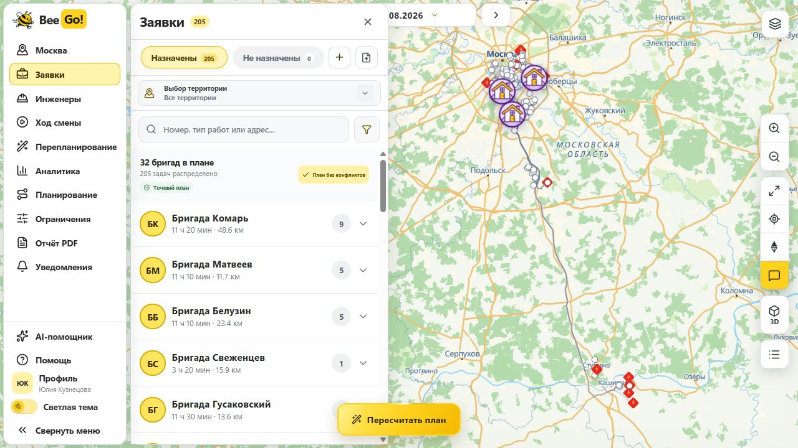

*Мы начинаем с карты и списка, потому что диспетчеру сначала нужно увидеть день целиком, а затем провалиться в конкретную заявку или бригаду. Карта показывает местоположение; список даёт точные поля и действия.*

## Продукт: рабочий день

### 1. Подготовить входные данные

Заявки и инженеров можно загрузить из CSV или JSON; XLS/XLSX поддерживаются дополнительно. Экран показывает исходные строки, сопоставление колонок и ошибки до отправки в расчёт. Координаты из файла используются напрямую; адрес без координат проходит геокодирование и проверку, неоднозначный результат не превращается в выдуманную точку.

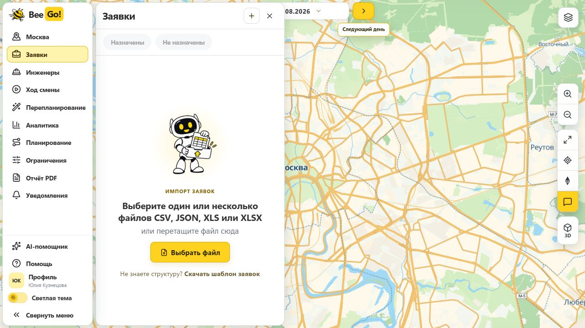

*Почему так:* качество оптимизации ограничено качеством входа. Диспетчер должен увидеть неверное окно или колонку до запуска долгого алгоритма. Разделы «Планирование» и «Ограничения» сейчас явно помечены как предпросмотр: их элементы управления не задают правил солверу.

### 2. Получить маршрут, который можно проверить

После расчёта видны назначенные и неназначенные заявки, бригады, порядок визитов, время прибытия/начала работы и геометрия дороги. Маршрут выбранной бригады выделяется на карте, а детали раскрываются по запросу. Для контрольной смены **17.08.2026** опубликованный набор содержит **205 назначений из 205 заявок**, в том числе **21 аварийную**; использованы **32 из 35 бригад**. Это результат конкретного входного набора, а не гарантия такого покрытия для любого дня.

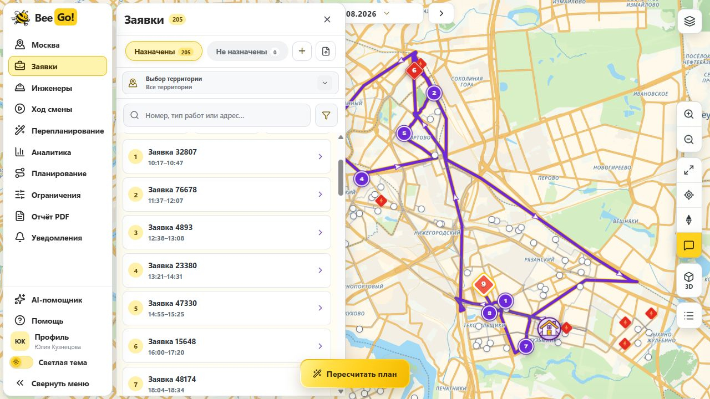

*Почему так:* число «назначено» без последовательности не помогает человеку объяснить клиенту приезд инженера. Оставшаяся без назначения заявка должна получить причину; ложное назначение хуже видимой очереди.

### 3. Провести смену и отреагировать на событие

«Ход смены» хранит версии плана, события и внесённые диспетчером факты. Для новой срочной заявки или другого изменения система строит **черновик** и показывает разницу. Начатые и уже прошедшие визиты сохраняются; публикация новой версии остаётся отдельным действием после проверки. Клиентское окно само по себе не сдвигается: такой перенос требует согласования с клиентом.

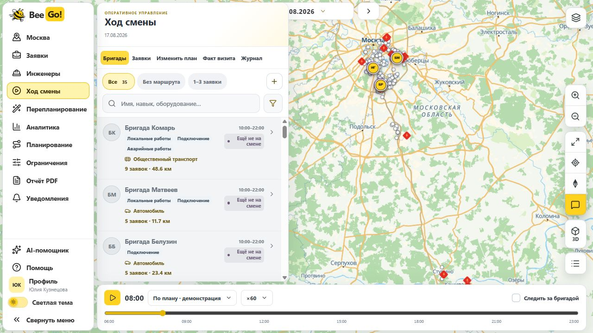

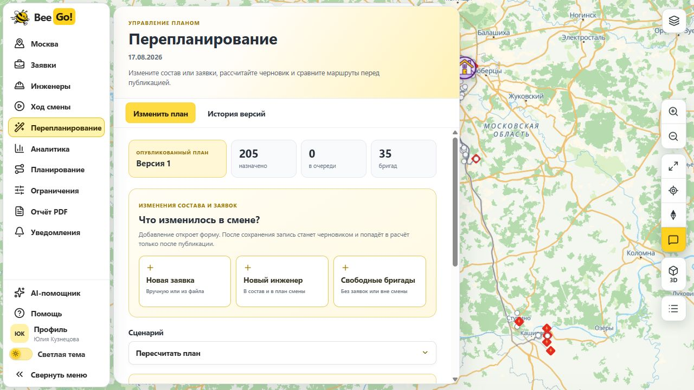

*Почему так:* во время смены нельзя незаметно переписать обещанное клиенту время или стереть факт выполненного визита. История версий позволяет восстановить, почему диспетчер изменил маршрут.

### 4. Понять результат, а не только увидеть графики

Аналитика начинает с итога выбранной смены и сравнения с простым базовым распределением «по поступлению». Для контрольной смены проверенный план BeeGo! назначает **205/205** заявок при суммарном пробеге **1 255,2 км**. Экран показывает также покрытие, число бригад, общий пробег и пробег на выполненную заявку у базового варианта: рост покрытия может сопровождаться ростом общего пробега. Базовый FCFS в интерфейсе оценивает дорогу по координатам и типовым скоростям, тогда как основной план проверяется маршрутизатором. Поэтому сравнение — **ориентир для обсуждения**, а не точный эксперимент с одинаковой транспортной моделью.

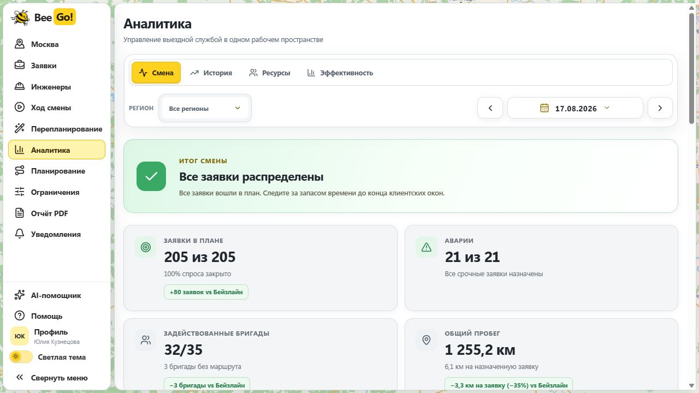

Отдельно доступны состав и загрузка бригад, история, ориентир будущего спроса и финансовая модель. Эти экраны помогают выбрать действие, но не заменяют новый проверенный маршрут. Финансовые ставки задаются как допущения; показанная экономия — **оценка сценария, не подтверждённая бухгалтерская прибыль**. Прогноз спроса содержит диапазон и ошибку на истории, а не обещание точного количества заявок.

<details>
<summary>Посмотреть остальные аналитические экраны</summary>

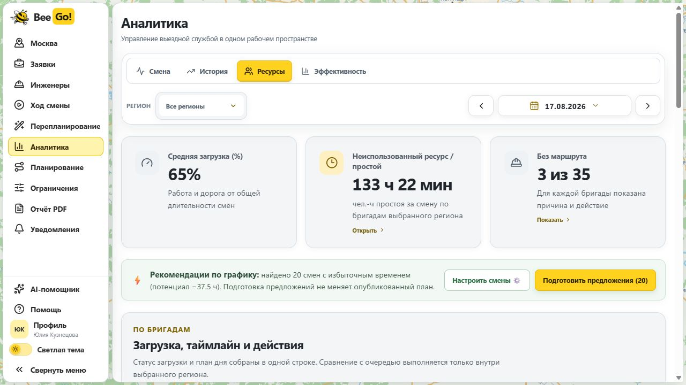

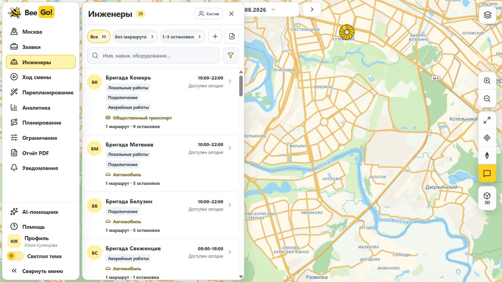

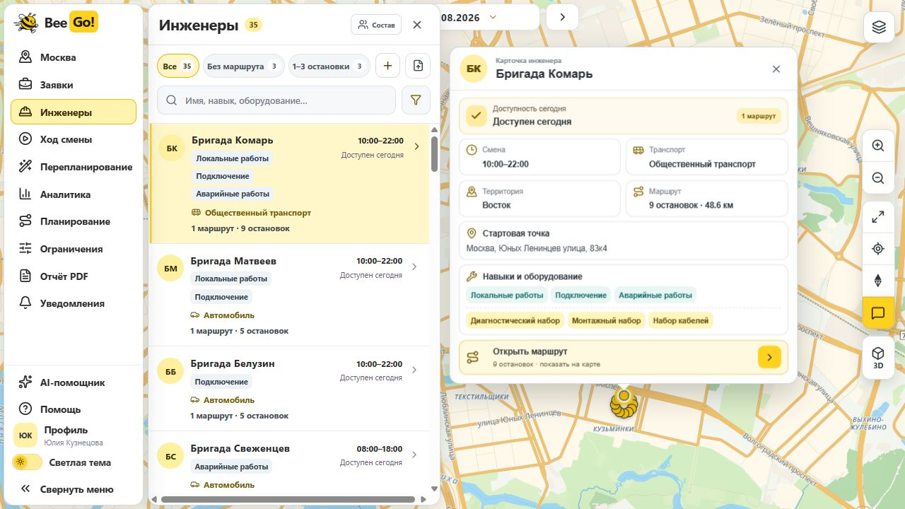

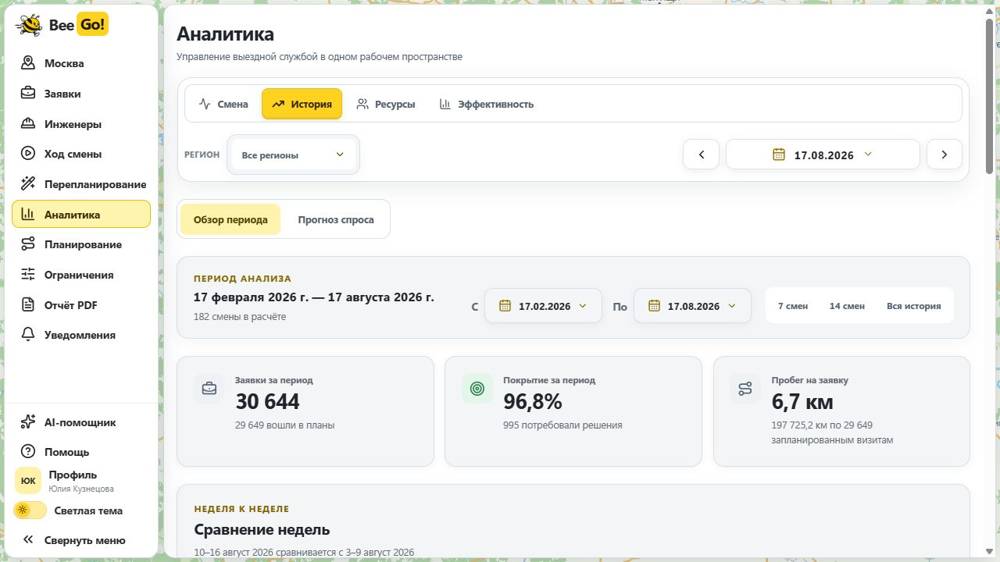

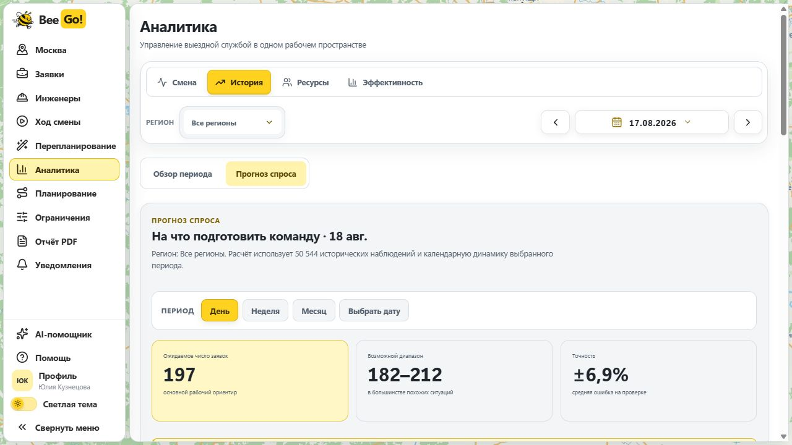

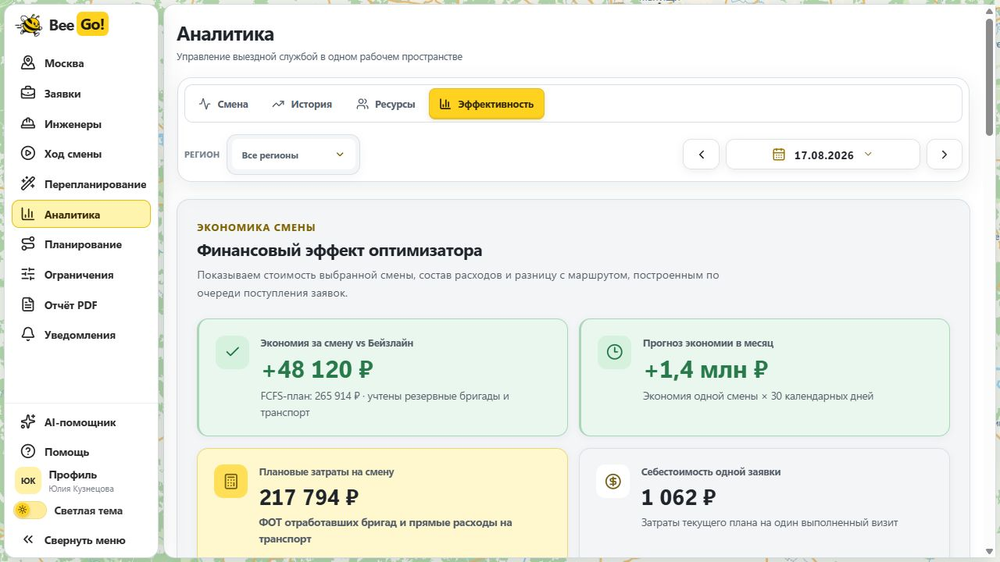

</details>

### 5. Передать результат человеку

PDF собирается из сохранённого состояния смены: маршруты, очередь, события, нагрузка и показатели. AI-помощник отвечает на вопросы по этому состоянию, но **не меняет план**. Ключ Yandex AI Studio хранится на сервере; есть лимиты обращений и токенов. Если AI недоступен, расчёт и PDF продолжают работать.

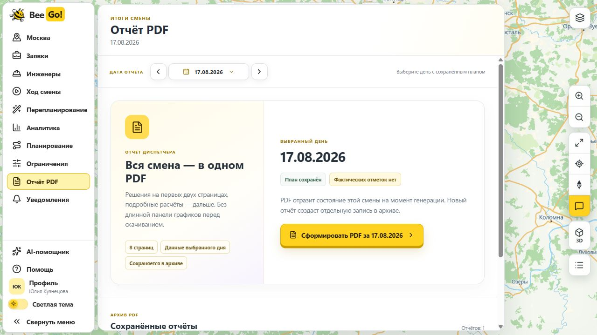


*Почему так:* объяснение важно для разговора с диспетчером и руководителем, но решение о назначении не должно зависеть от свободного текста языковой модели.

## Алгоритм и проверка


Сначала планировщик ищет максимальное покрытие допустимых заявок, затем уменьшает число занятых бригад и улучшает реакцию на аварии, дорогу, ожидание и баланс. Навыки, оборудование, транспорт, клиентские окна и границы смены проверяются независимо от визуального представления. Приехать раньше окна и подождать можно; **начать работу** нужно внутри окна, закончить — до конца смены.

Публикация разрешена только для результата со статусами `EXACT_VALID`, `publicationAllowed=true` и `validation.status=VALID`, с контрольной суммой содержимого и без приблизительных участков. Здесь «точный» означает **проверенный на используемых входных данных и модели движения план**. Это не доказательство глобального математического оптимума и не гарантия дорожной ситуации в реальном времени. Подробности — в [техническом описании алгоритма](docs/planning.md).

## Маршруты и расписания

Для автомобиля, велосипеда и пеших переходов мы используем локальную **Valhalla на данных OpenStreetMap**. Для наземного общественного транспорта — GTFS, для МЦК/МЦД — сохранённые снимки расписания Яндекс Расписаний, для метро — схему поездок и явное допущение ожидания **180 секунд на посадку**. Все виды движения сводятся в проверку одного маршрута инженера.

Мы выбрали локальный стек, потому что прототипу с большим числом проверок матриц и повторных прогонов нужна воспроизводимая стоимость и возможность работать без коммерческой подписки на Routing API 2ГИС. Это осознанный компромисс, а не утверждение, что локальные данные столь же актуальны. [Документация 2ГИС](https://docs.2gis.com/en/api/navigation/routing/start) описывает доступ по ключу и подписке; [Routing API](https://docs.2gis.com/en/api/navigation/routing/overview) поддерживает учёт пробок и общественный транспорт, включая МЦК/МЦД, а [Distance Matrix API](https://docs.2gis.com/en/api/navigation/distance-matrix/start) — массовые пары точек. Для промышленного продукта это могло бы улучшить оценку времени в актуальной дорожной обстановке и упростить поддержку транспортных данных. Но провайдер маршрутов сам по себе не проверяет навыки, оборудование и всю смену — эта ответственность останется у BeeGo!.

Мы постарались сделать локальный вариант честным: идём по дорожной сети вместо прямой, учитываем минуты отправления GTFS и МЦК/МЦД, отдельно считаем пешеходные подходы, перепроверяем быстрые матрицы детальными маршрутами и сохраняем происхождение данных. Если необходимого расписания нет, расчёт останавливается с причиной вместо подстановки случайного времени.

Для стенда мы положили в [репозиторий недельный комплект МЦК/МЦД](data/transit/weekly-rail-snapshots-2026-09-29.zip) и установили его на сервер. При новом расчёте используется снимок **того же дня недели**: например, для вторника 18.08.2026 — вторник 29.09.2026. Это эталон, а не настоящее историческое расписание 18 августа; задержки, отмены и сезонные изменения не учитываются. Исправление проверено построением индекса и новым валидным небольшим планом для 18.08.2026. Правила выбора и установка описаны в [документации по данным](docs/data.md).

## Аналитика и границы данных

В репозитории есть **182 дня аналитической истории** с 17.02 по 17.08.2026. Предыдущие дни сформированы из отдельных синтетических входных наборов и рассчитанных планов; это не телеметрия реальных выездов. Значение `actual: null` означает, что фактическое исполнение неизвестно. Финансовые оценки и прогноз не следует выдавать за доказанный эффект внедрения.

На текущем стенде полный операционный архив для повторного открытия и событийного пересчёта есть **только для 17.08.2026**. Сводная аналитика 182 дней доступна отдельно; остальные многогигабайтные операционные архивы не включены в Git. Так мы не смешиваем «вижу исторический график» с «могу воспроизвести каждый маршрут и событие того дня». Формат и происхождение описаны в [разделе о данных](docs/data.md).

## Архитектура

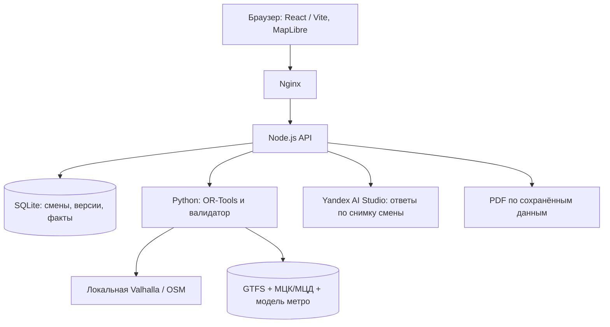

На стенде работает **один экземпляр API и один слот расчёта**. Несколько человек могут смотреть страницы; если кто-то уже запустил точный расчёт, второй получит понятное «Подождите» и HTTP `429 PLANNING_BUSY`. Так два тяжёлых задания не забьют небольшой сервер. SQLite хранится вне каталога релиза, а новые версии кода переключаются через отдельные каталоги. Это рассчитано на демонстрационный стенд с одним вычислителем; при нескольких экземплярах API слот придётся вынести в общее хранилище. Схема развёртывания и восстановление — в [операционной документации](docs/operations.md).

## Запуск и проверка

Для знакомства проще открыть [стенд](http://84.252.135.110/). Для локальной разработки нужны Node.js, Python-окружение алгоритма и локальная Valhalla для новых дорожных расчётов. Пошаговый запуск — в [руководстве по развёртыванию](deploy/README_RU.md) и [локальной инструкции сайта](site/README.md).

```powershell
cd site
pnpm install --frozen-lockfile
pnpm run build
pnpm run test:algorithm
pnpm run test:sites
```

Для нового расчёта проверьте доступность маршрутизатора, транспортного индекса и Python-зависимостей; статическая сборка сама по себе не выполняет оптимизацию. Серверные секреты задаются через окружение, не включаются в Git.

## Что ещё требуется для эксплуатации

- Домен, HTTPS и пользовательская аутентификация: текущий публичный адрес и стенд предназначены для демонстрации, не для персональных данных клиентов.
- Регулярное обновление карт и расписаний, учёт текущих пробок и отмен транспорта; недельный снимок этого не заменяет.
- Полные операционные архивы для тех исторических дней, которые нужно переоткрывать и перепланировать.
- Регулярные резервные копии SQLite, мониторинг диска и ошибок; на стенде база уже отделена от релиза.
- Проверка качества на независимых реальных днях и измерение эффекта относительно фактических процессов.

Эти границы для нас часть решения: продукт должен говорить, **что он знает**, **что предполагает** и **когда диспетчеру нужно принять решение самому**.
