# BeeGo! — планирование выездных бригад

**От адреса заявки до опубликованного плана смены, который диспетчер может проверить и изменить.**

Мы сделали этот README рассказом о принятых решениях: что видно в продукте, как это обеспечено алгоритмом и почему компоненты устроены именно так. Команды, форматы данных и процедуры развёртывания вынесены в [техническую документацию](docs/README.md).

<a id="screencast"></a>
## Скринкаст

Рекомендуем начать со скринкаста: он показывает импорт заявок, построение маршрутов, работу со сменой, перепланирование и отчёт.


**Ссылка на скринкаст:** —
<!-- SCREENCAST_LINK: заменить строку выше на **[▶ Смотреть скринкаст](URL)** -->

**[Открыть стенд](http://84.252.135.110/)** · **[Документация](docs/README.md)** · **[Проверка соответствия требованиям](site/docs/task-requirements.md)**

## Содержание

| Продукт | Техническая часть |
| --- | --- |
| [01. Карта и рабочее пространство](#workspace) | [08. Архитектура](#architecture) |
| [02. Импорт данных и поиск адреса](#input) | [09. Алгоритм и проверка ограничений](#algorithm) |
| [03. Инженеры и состав смены](#engineers) | [10. Дорожные данные и расписания](#routing) |
| [04. Ход смены](#shift) | [11. События и публикация плана](#events) |
| [05. Перепланирование](#replanning) | [12. Данные аналитики](#analytics-data) |
| [06. Аналитика](#analytics) | [13. Быстрый старт через Docker](#docker-start) |
| [07. Отчёт, AI-помощник и справка](#report) | [14. Развёртывание и проверка стенда](#deployment) |
| [Скринкаст и стенд](#screencast) | [Лицензии компонентов и данных](THIRD_PARTY_LICENSES.md) |

---

<a id="workspace"></a>
## 01. Карта и рабочее пространство


На карте видны точки и маршруты, в левой панели — точные сведения о заявках и бригадах. Нажатие на маршрут связывает геометрию с порядком визитов, временем и составом работ. Мы сохранили карту как рабочий контекст во всех основных разделах: при переходе к смене, аналитике или отчёту диспетчер не теряет день, с которым работает.


На карте доступны:

- **Заявки и бригады.** Показаны адреса заявок, стартовые точки бригад и маршруты по дорожной сети. Значки различают аварийные заявки, назначенные и оставшиеся в очереди; в выбранном маршруте видны порядок остановок и направление движения.
- **Подробности по нажатию.** Карточка заявки показывает адрес, клиентское окно, вид и норматив работы, оборудование, приоритет, запланированное время прибытия и бригаду. Для заявки в очереди доступны причина и проверка подходящих бригад. Из стартовой точки можно открыть маршрут конкретной бригады.
- **Выбор области и маршрута.** Поиск и фильтры в списке обновляют точки на карте; можно выбрать зону или район, выделить маршрут и приблизить карту к заявке или всем видимым точкам. Легенда объясняет обозначения и позволяет переключать режим выделения маршрута и цвета бригад, когда маршрутов не больше восьми.
- **Просмотр смены.** Карта показывает положение бригад и пройденную часть маршрута на выбранный момент времени; запланированное завершение и фактическая отметка имеют разные обозначения.
- **Выбор точки для новой заявки.** При ручном добавлении или перепланировании координаты можно указать нажатием на карте; выбранная точка отображается маркером.
- **Управление отображением.** Доступны масштаб, возврат ориентации на север, светлая и тёмная темы, 3D-здания, включение подсказок и показ текущего местоположения с разрешения браузера.

<a id="input"></a>
## 02. Импорт данных и поиск адреса

Заявки и состав инженеров принимаются из CSV/JSON; XLS/XLSX доступны через экран импорта. Сопоставление столбцов, проверка обязательных полей и предпросмотр строк происходят **до** расчёта. Координаты из источника сохраняются; для текстового адреса используется серверный Geoapify.


Ручная заявка проходит тот же путь: адрес можно выбрать из подсказки или указать на карте, затем задать работу, приоритет, окно и оборудование. Она становится входом для **черновика** перепланирования, а не незаметным изменением уже опубликованного маршрута.

<a id="engineers"></a>
## 03. Инженеры и состав смены


В реестре видны доступность, зона, навыки, транспорт и оборудование. Карточка раскрывает назначенные остановки и загрузку конкретного инженера; отдельный состав смены позволяет добавить резерв или вывести человека из работы через событие.


Допуск и оснащение бригады определяют, можно ли назначить ей заявку. Алгоритм отсекает несовместимые пары до вычислительно затратного поиска, а интерфейс показывает причину исключения.

<a id="shift"></a>
## 04. Ход смены


В разделе **Ход смены** доступны маршруты бригад и заявки, шкала времени, события и фактические отметки. Проигрывание времени показывает состояние опубликованного плана в выбранный момент.


Операционная история сохраняется отдельно от плана. Фактические отметки позволяют после смены отличить ошибку маршрута от отмены клиентом и оценить исполнение независимо от анимации карты.

<a id="replanning"></a>
## 05. Перепланирование


Новая авария, отмена, недоступность инженера, изменение окна или добавление ресурса оформляются как событие. Отмена снимает заявку с будущего маршрута; опубликованный план меняется только после проверки и подтверждения черновика. Для новой заявки планировщик сначала ищет точную вставку в действующие маршруты. Если она не найдена, он заново собирает будущую часть дня, сохраняя уже начатые визиты.


Публикация создаёт новую версию и запись в журнале; прежнюю можно восстановить отдельной новой ревизией. Черновик и опубликованный план хранятся раздельно, поэтому сбой расчёта или закрытие вкладки не переписывает текущую смену.

Диспетчер должен видеть, какое обещание клиенту меняется. Автоматическая замена активного плана после каждого события лишила бы человека возможности проверить последствия и объяснить решение.

<a id="analytics"></a>
## 06. Аналитика

### Смена


Для контрольного дня **17.08.2026** проверенный план назначает **205 из 205** заявок, включая **21 аварийную**, задействует **32 из 35** бригад; суммарный маршрут — **1 255,2 км**. Сводка сразу соединяет покрытие, очередь, пробег и число бригад: полное назначение само по себе ещё не говорит о расходе ресурсов.

На экране есть **бейзлайн FCFS** — распределение в порядке поступления: **125 из 205**. Его интерфейсная модель использует приближённые расстояния и типовые скорости; основной план учитывает локальные дороги и расписания. Сравнение показывает разницу в покрытии, а расстояния двух моделей следует читать с учётом разных способов расчёта.

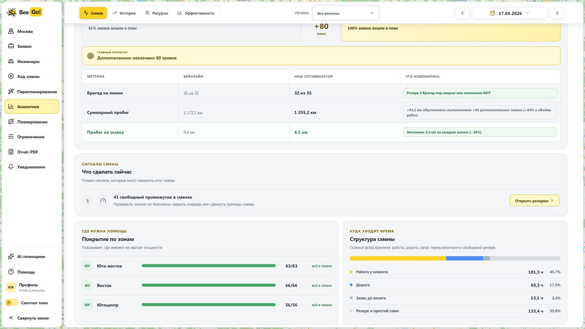

| Элемент | Что даёт диспетчеру |
| --- | --- |
| Покрытие, аварии, очередь | Проверить результат по всем заявкам и отдельно по срочным работам. |
| Бейзлайн FCFS | Увидеть, сколько заявок назначает простое правило поступления на тех же входных данных. |
| Зоны и состав смены | Найти территории с нехваткой подходящих бригад и оценить запас ресурсов. |
| Структура времени и рекомендации | Отличить время работы от дороги и простоя; перейти от показателя к конкретному действию. |

### История


История охватывает **182 рассчитанных дня** с 17.02 по 17.08.2026. Фильтр периода, покрытие, очередь и пробег на заявку показывают динамику; сравнение соседних периодов помогает заметить изменение нагрузки до просмотра отдельных смен.

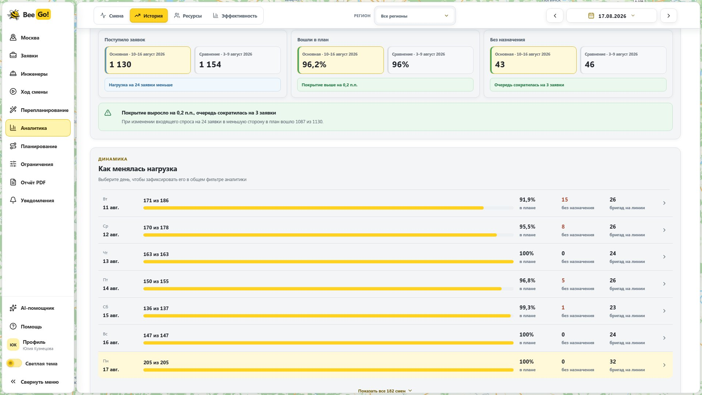

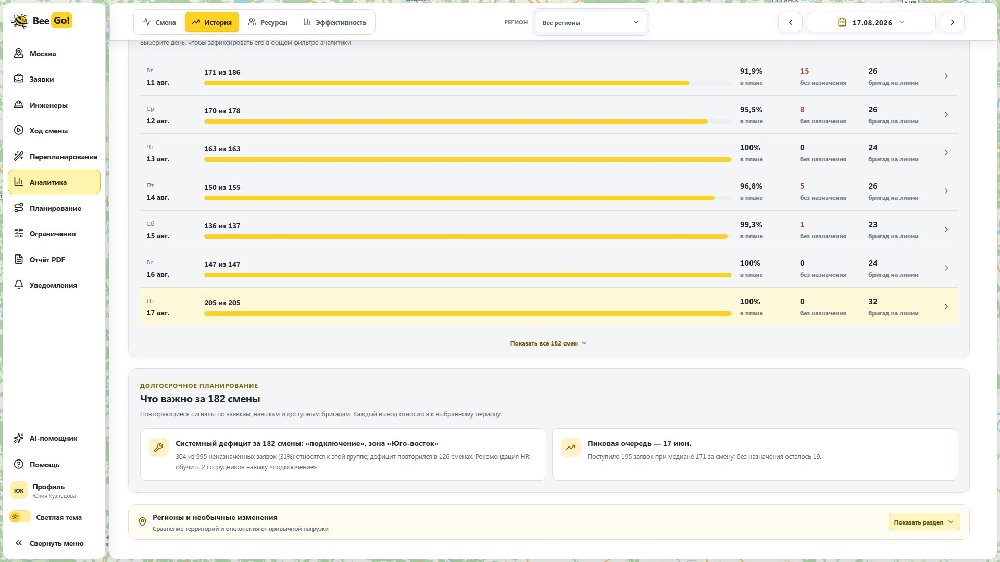

Список дней позволяет открыть дату с необычной очередью. Ниже система формирует объяснения по всей истории: называет повторяющийся дефицит навыка и зоны, число затронутых заявок и дней, затем предлагает действие. Это полезнее общего предупреждения о снижении процента покрытия.

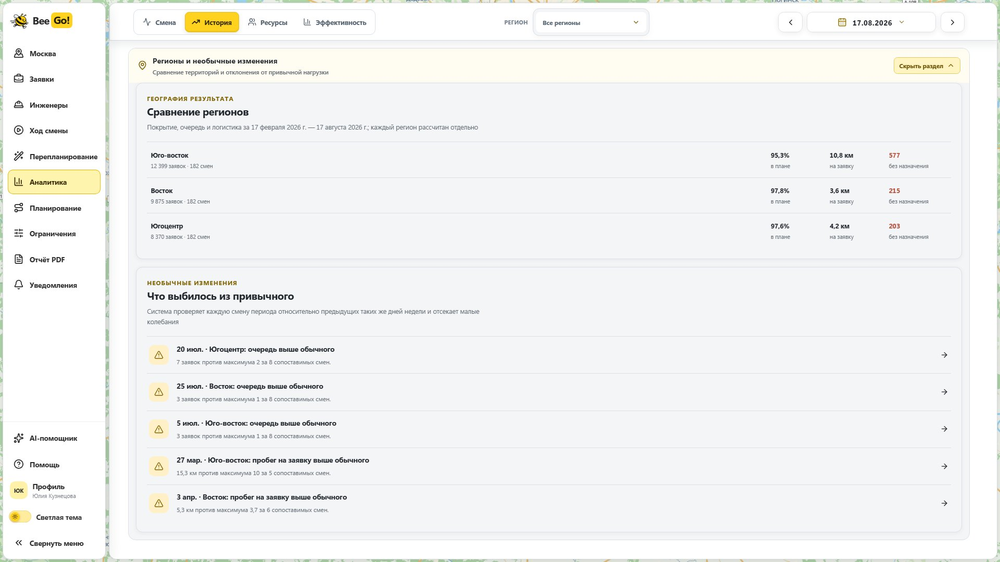

Разрез по территориям связывает покрытие, пробег и очередь с местом возникновения проблемы. Необычные изменения сопоставляются с типичными значениями для аналогичных дней недели, поэтому разовый пик можно отделить от повторяющегося дефицита.

### Прогноз спроса


Для следующего дня прогноз показывает **197 заявок**, диапазон **182–212** и ошибку на истории **WAPE 6,9%**. Диапазон нужен для решения о резерве: штат, рассчитанный ровно на центральное значение, может не покрыть верхнюю границу спроса. На этом экране рекомендованы **32 бригады** и **320 человеко-часов**; отдельно выделены требования к навыку подключения и интервал повышенной нагрузки.

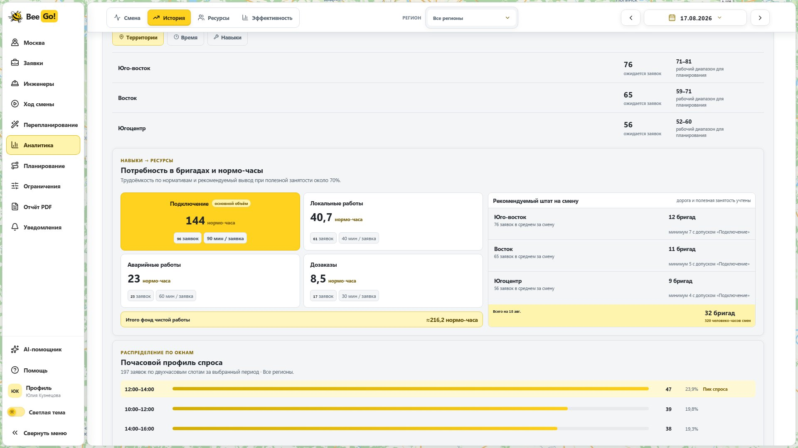

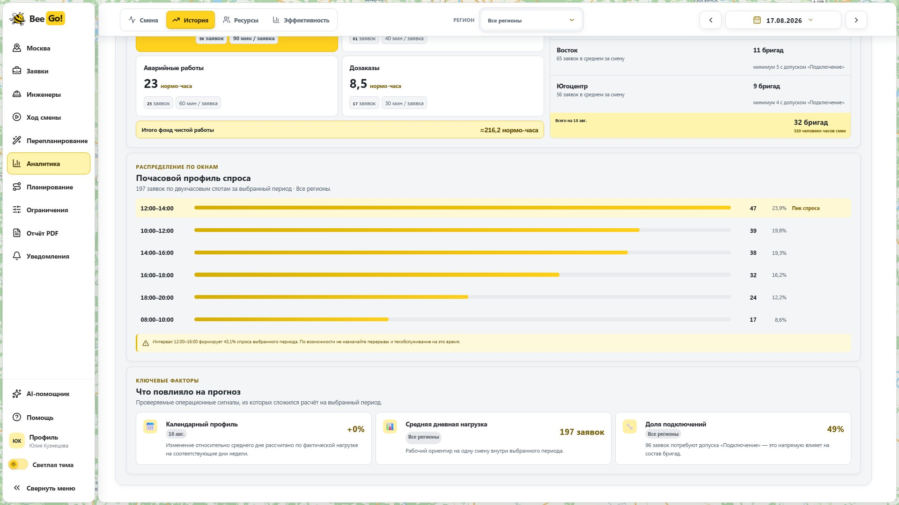

Разрезы по зонам и навыкам переводят число заявок в состав смены. Почасовой профиль показывает, когда нужен резерв, а пояснение модели раскрывает использованные признаки: календарь, средний спрос и долю работ по подключению.

### Ресурсы


Здесь видны средняя загрузка, свободные часы и бригады без маршрута. Реестр можно фильтровать по зоне, навыку, транспорту и состоянию. Для каждого инженера показаны загрузка, назначенные работы и причина, по которой ему предлагается действие или оставляется резерв.

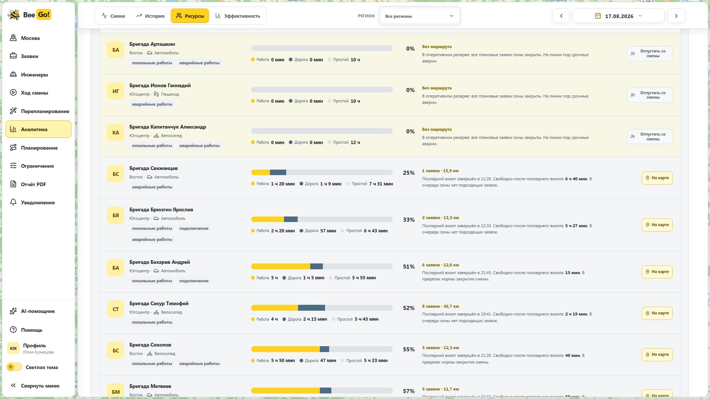


Временная диаграмма показывает работу, раннее прибытие и свободное окно на общей шкале 08:00–22:00. По ней видно, где именно возникает простой и можно ли рассматривать бригаду для новой заявки; окончательное назначение всё равно проходит расчёт и валидацию.

### Эффективность


Финансовая модель переводит плановые часы и пробег в стоимость по редактируемым ставкам. Видны стоимость смены и заявки, ФОТ, транспорт по видам и сравнение с FCFS. Месячная проекция — расчёт по заданным тарифам, а не измеренная экономия; изменение тарифа сразу показывает чувствительность вывода.

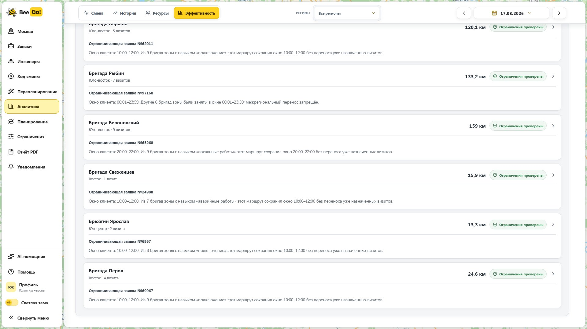

Сравнение видов транспорта показывает пробег, время и стоимость визита. Для длинных маршрутов система называет **ограничивающую заявку** и объясняет, что повлияло на путь: окно клиента, навык, зона или доступный транспорт. Это позволяет обсуждать конкретный маршрут, а не только его общий километраж.

<a id="report"></a>
## 07. Отчёт, AI-помощник и справка

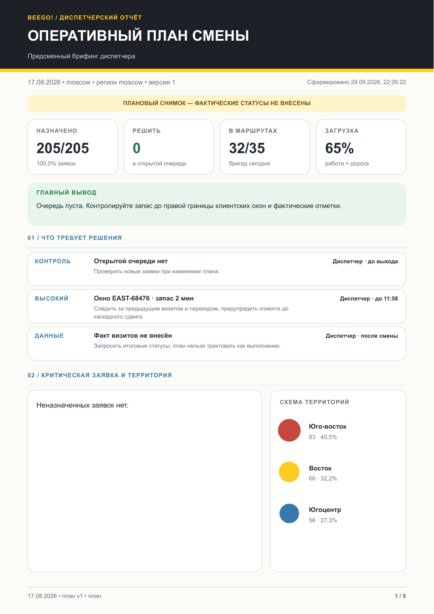

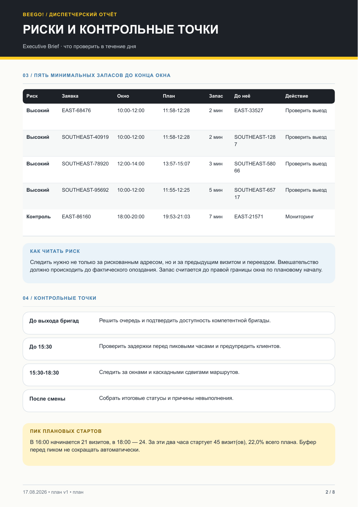

**[Открыть полный PDF-отчёт за 17.08.2026](docs/assets/beego-report-2026-08-17.pdf)** · 8 страниц.

PDF собирается на сервере из сохранённой ревизии смены: итог, маршруты, очередь, ресурсы, события и факты. Новый выпуск попадает в архив отдельной записью; старый не перезаписывается. Итог и контрольные точки находятся в начале, детализация маршрутов — дальше.


AI-помощник добавлен как необязательная поддержка оператора: если в маршруте, показателе или событии трудно разобраться, можно задать вопрос по выбранной смене. Он получает ограниченный снимок данных и поясняет его; публикацию плана, расчёт и цифры PDF определяют отдельные функции системы. Ключ Yandex AI Studio хранится на сервере.

Уведомления собирают результаты операций и важные события; справка проводит по интерфейсу. Профиль на стенде отвечает за отображаемые данные и оформление, **не является системой аутентификации**. Эта граница видна и в архитектуре доступа.


---

<a id="architecture"></a>
## 08. Архитектура


Браузер показывает карту, списки, аналитику и результаты операций. Nginx отдаёт интерфейс и направляет запросы `/api` в **один процесс Node API**. Сервер хранит операционную смену, версии, события и фактические отметки в SQLite; расчёт запускает в Python-процессе и передаёт ему локальные дорожные и транспортные данные. Начальный расчёт и предпросмотр перепланирования занимают один общий вычислительный слот. Остальные пользователи могут просматривать сайт во время расчёта.

Поиск адресов обращается к Geoapify через API. PDF собирается сервером из сохранённой версии; AI-помощник отправляет ограниченный снимок смены в Yandex AI Studio. Эти функции не участвуют в проверке маршрута. Исторические агрегаты аналитики загружаются отдельно от полных операционных смен. Секреты внешних сервисов хранятся на сервере.

| Компонент | Роль и причина выбора |
| --- | --- |
| React/Vite + MapLibre | Быстрый интерактивный обзор карты, списков и временной шкалы без переноса правил допустимости в браузер. |
| Nginx | Отдаёт собранный интерфейс и проксирует API на одной VM. |
| Node API | Принимает действия диспетчера, управляет одним слотом расчёта, проверяет статус результата и публикует версии. |
| SQLite | Хранит черновики, ревизии, журнал, факты и архив отчётов транзакционно; для одного небольшого стенда достаточно одной базы. |
| Python + OR-Tools | Первичный CP-SAT поиск, событийный точный поиск и независимая проверка плана отделены от интерфейса. |
| Valhalla + транспортный индекс | Локальные дороги OSM, GTFS, МЦК/МЦД и метро дают повторяемый расчёт без оплаты каждого массового дорожного запроса. |
| Geoapify | Подсказки адресов и геокодирование; не выбирает дорожный маршрут для проверки плана. |
| PDF и Yandex AI Studio | PDF воспроизводится из сохранённой ревизии; ответы AI не меняют план и расчётные показатели. |

<a id="algorithm"></a>
## 09. Алгоритм и проверка ограничений

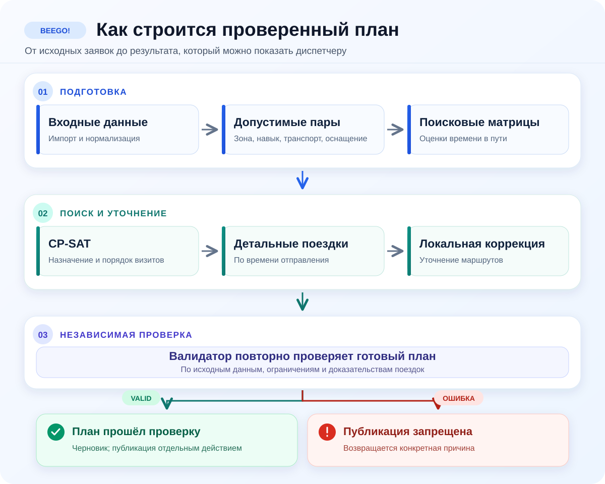

Слева показан первичный расчёт: от допустимых пар и поисковых матриц до CP-SAT, детальных поездок и локальной коррекции. Справа — событийный расчёт от **опубликованной версии**. Он сохраняет начатую часть дня; для новой заявки сначала проверяет точную вставку, затем при необходимости перестраивает будущие визиты. Другие события изменяют только допустимую будущую часть. Только завершённый поиск может оставить новую заявку в очереди с причиной; при истечении лимита черновик не публикуется. Оба пути проходят независимый валидатор и контроль статуса на сервере перед сохранением результата.

Для неизменённого контрольного набора API может использовать заранее сохранённый проверенный артефакт; новые входные данные запускают Python-планировщик. Перепланирование не подменяет эту ветку повторным первичным CP-SAT расчётом.

### 9.1. Отбор допустимых пар

Для каждой пары заявки и инженера проверяются создание заявки к моменту расчёта, доступность человека, территория, навык, допустимый транспорт, личное многоразовое оборудование и жёсткое закрепление. Затем проверяется теоретическое пересечение окна начала работы со сменой с учётом норматива. Причины отклонения сохраняются кодами, чтобы необслуженная заявка получала объяснение.

Общее оборудование учитывается как ограниченный ресурс по территории; суммарное назначение не превышает доступное количество. Входные нормы работ не включают дорогу: подключение **70 мин**, глобальная проблема **80 мин**, дозаказ **20 мин**, локальная работа **30 мин**. Дорога рассчитывается отдельно.

### 9.2. Как соблюдаются ограничения ТЗ

Правила включены в модель поиска, а [отдельный валидатор](algorithm/src/beeline_planning/validator.py) повторно проверяет **готовый план по исходным данным и расчётам поездок**. Результат проверки основан на данных и ограничениях; для нарушений возвращаются конкретные коды.

| Правило | Как не допускаем нарушение при поиске | Что независимо проверяется перед публикацией |
| --- | --- | --- |
| Каждая известная заявка имеет ровно один итог | Для заявки CP-SAT задаёт ровно один исход: назначение инженеру либо постановка в очередь. Заявка, созданная позже момента расчёта, ещё не участвует. | Нет дублирования, одновременного назначения и очереди, пропавших и неизвестных заявок (`DUPLICATE_ASSIGNMENT`, `JOB_RESULT_MISSING` и др.). |
| Квалификация и территория | В граф допускаются только доступные инженеры своей зоны с нужным навыком. | Для каждого визита заново сопоставляются инженер, зона, навык и доступность (`ZONE_MISMATCH`, `SKILL_MISSING`, `ENGINEER_UNAVAILABLE`). |
| Транспорт | Требование заявки сопоставляется с режимом инженера до создания пары. | Совпадение разрешённого транспорта и режима фактического дорожного ответа (`TRANSPORT_MISMATCH`, `ROUTE_MODE_MISMATCH`). |
| Личное и общее оборудование | Личный многоразовый комплект проверяется для пары; общий расходуемый запас ограничен суммой назначений по зоне. | Достаточность у инженера и суммарный лимит склада (`PERSONAL_EQUIPMENT_MISSING`, `SHARED_INVENTORY_EXCEEDED`). |
| Окно клиента и смена | Время старта работы — переменная в закрытом клиентском окне; дорога, ожидание и норматив должны уложиться в смену. | Начало не раньше прибытия и внутри окна; окончание работы до конца смены (`SERVICE_BEFORE_ARRIVAL`, `TIME_WINDOW_VIOLATED`, `SHIFT_VIOLATED`). Ранний приезд с ожиданием допустим. |
| Непрерывность маршрута | Дуги образуют последовательность от стартового офиса; ограничены число заявок и длительность маршрута. Возврат в офис для MVP не обязателен. | Каждый участок начинается там, где закончился предыдущий, рассчитан на нужное время отправления; нет перекрытия работ и превышения лимитов (`ROUTE_CHAIN_BROKEN`, `ROUTE_DEPARTURE_MISMATCH`, `MAX_JOBS_EXCEEDED`, `MAX_ROUTE_MINUTES_EXCEEDED`). |
| Доступность дороги | Поисковая оценка только предлагает дугу; итоговая последовательность пересчитывается детальным провайдером. | Недостижимый или неизвестный путь, несоответствие округления минут и необоснованное нулевое время переезда блокируют план (`ROUTE_UNREACHABLE`, `ROUTE_UNKNOWN`, `ROUTE_ROUNDING_INVALID`, `IDENTITY_ROUTE_INVALID`). |
| Аварии и закрепления | При частичном покрытии сначала минимизируется число необслуженных аварий; после покрытия улучшается время реакции. Жёсткое назначение фиксируется в модели. | Аварийность пересчитывается в метриках, а обязательный инженер проверяется кодом `HARD_COMMITMENT_VIOLATED`. Приоритет не разрешает нарушать время, навык или транспорт. |
| Событие в середине смены | Пересчёт получает время события и замороженную прошлую часть маршрута. | Не изменены уже начатые, идущие и завершённые участки; недоступный инженер не получает новую работу до возвращения (`FROZEN_ACTIVITY_CHANGED`, `UNAVAILABLE_AFTER_EVENT`). |

Входные отметки времени должны иметь часовой пояс и целые минуты; валидатор проверяет это отдельно. Если дорожный ответ отсутствует, статус становится `ROUTING_INCOMPLETE` или `INVALID`, а не `VALID`. Необслуженная работа остаётся в очереди с причиной. Аналитика может оценить потребность в дополнительной бригаде, но такая оценка сама по себе **не является новым маршрутом**: добавленный ресурс проходит полноценный пересчёт.

### 9.3. Поиск и проверка допустимости

CP-SAT выбирает назначение и последовательность по графу допустимых переходов. Поисковые матрицы позволяют перебрать много комбинаций на одной VM; для общественного транспорта они могут недооценить ожидание в конкретную минуту. На уровне цели сначала ищется полное покрытие допустимого набора. После покрытия сокращается число занятых бригад, затем время реакции на аварии; следующие уровни улучшают дорогу, ожидание и баланс.

**Почему такой порядок целей.** Пять сэкономленных километров не компенсируют оставленную без обслуживания заявку. Реакция на аварию важна, но не должна незаметно отнимать исполнителя у другой обязательной работы или требовать лишнюю бригаду, когда задача допускает полное покрытие существующим составом.

### 9.4. Проверяем конкретную последовательность

После поиска маршрут каждой бригады рассчитывается последовательно: время отправления на следующий участок зависит от окончания предыдущей работы. Если инженер приехал раньше окна, он может ждать; **начать работу** нужно внутри клиентского окна, закончить — до конца смены. Далее применяются локальные перестановки, переносы и цепочки вытеснений; принятое улучшение снова проходит детальную проверку **всего** плана.

Контроль публикации реализован в двух местах: Python выставляет результат независимой проверки, а [серверное хранилище](site/server/shiftStore.mjs) не принимает план без `EXACT_VALID`, `publicationAllowed=true`, `validation.status=VALID`, `contentSha256` и при наличии признака `approximateTravel`. Эти проверки действуют при начальном расчёте и при публикации событийного черновика. `EXACT_VALID` означает допустимость **в рамках входных данных и транспортной модели**, а не доказательство глобального оптимума или знание будущих пробок.

### 9.5. Улучшение первичного плана

После базового назначения [конвейер нового набора](algorithm/tools/run_new_dataset_pipeline.py) может выполнить несколько этапов в пределах бюджета расчёта:

| Этап | Назначение |
| --- | --- |
| Стартовый VRPTW-кандидат | Даёт CP-SAT начальный порядок по поисковой модели, если такой кандидат удалось найти. |
| Уточнение и точная материализация | Проверяет поездки по времени отправления; при конфликте корректирует поисковый граф. |
| Прямые вставки, цепочки и LNS | Пытается назначить оставшиеся заявки и улучшить маршруты с повторной точной проверкой. |
| Сокращение числа бригад | Переносит работы между маршрутами только после проверки нового полного плана. |
| Уточнение времени выезда | Сдвигает ожидание перед поездкой только с повторным расчётом изменённого участка. |

При ограничении времени отдельные улучшения могут не выполниться. Статус публикации определяется проверкой **итогового** плана, а не самим фактом завершения CP-SAT.

<a id="routing"></a>
## 10. Дорожные данные и расписания

| Движение | Рабочий источник | Как проверяется время |
| --- | --- | --- |
| Автомобиль, велосипед, пеший путь | Локальная Valhalla на OpenStreetMap | Путь по сети, длительность, расстояние и геометрия. |
| Автобус и трамвай | GTFS | Календарь, остановки и конкретное отправление. |
| МЦК и МЦД | Сохранённые ответы Яндекс Расписаний | Отправления эталонного дня недели. |
| Метро | Схема перегонов, входов и пересадок | Явное ожидание **180 секунд при посадке**; полного расписания поездов нет. |

Пешие подходы к станциям считаются по уличной сети. В общей транспортной сети возможны пересадки между наземными маршрутами, метро, МЦК и МЦД; для короткого плеча сравнивается и прямой пеший путь. Время и геометрия наземных и рельсовых участков имеют разное происхождение; схематичная линия на карте обозначается отдельно от точной траектории рельсов.

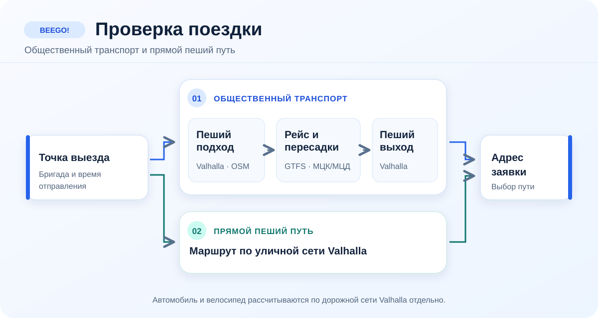

**Почему локальная Valhalla.** Для прототипа с многократным перебором матриц и проверкой тысяч участков подписка на коммерческий Routing API 2ГИС была бы существенной и плохо предсказуемой статьёй расходов. Локальный стек даёт воспроизводимость и фиксированную стоимость VM. Мы не заменили дороги прямыми линиями: используем сетевые пути, реальные отправления доступных GTFS/МЦК/МЦД, явные пересадки, время отправления и повторную детальную проверку кандидата.

**Что дало бы подключение 2ГИС в реальном продукте.** [Routing API](https://docs.2gis.com/en/api/navigation/routing/overview) и [Distance Matrix API](https://docs.2gis.com/en/api/navigation/distance-matrix/start) позволили бы получать актуальнее дорожные времена, учитывать пробки и опираться на поддерживаемые провайдером транспортные данные. Это улучшило бы ETA и уменьшило нашу нагрузку по обновлению карт и расписаний. Подписка и лимиты запросов потребовали бы отдельной экономической модели и кэширования. Даже с 2ГИС BeeGo! по-прежнему обязан проверять навыки, оснащение, клиентские окна, общий ресурс и всю смену.

**Недельный эталон МЦК/МЦД.** В [репозитории лежит проверяемый комплект](data/transit/weekly-rail-snapshots-2026-09-29.zip); установщик сверяет размер и SHA-256. Для сценарного дня используется снимок **того же дня недели**. Это пригодно для демонстрации типового графика, но не является историческим расписанием конкретной даты: отмены, ремонт и сезонные изменения требуют обновления данных. При отсутствии нужного снимка расчёт останавливается с указанием причины и не подставляет несуществующее отправление. Подробности и установка — в [документации данных](docs/data.md).

Geoapify решает **другую** задачу: предлагает адреса и координаты при импорте и ручном вводе. Ключ поиска хранится на сервере; он не меняет провайдера детального дорожного расчёта. Для явного выбора Geoapify как отдельного дорожного провайдера предусмотрен отдельный `GEOAPIFY_ROUTING_API_KEY`.

<a id="events"></a>
## 11. События и публикация плана

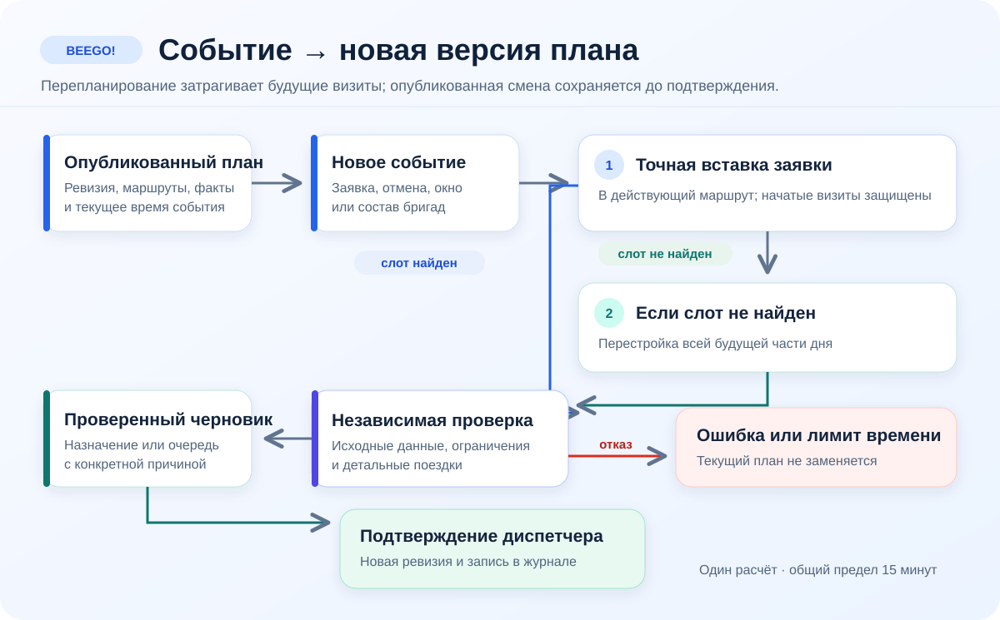

Событие задаёт время, тип, причину и затронутые сущности. Перепланировщик сохраняет завершённые и начатые визиты, работает с будущей частью маршрута и возвращает проверенный черновик. При публикации в SQLite транзакционно появляются новая ревизия и запись журнала. Факты не выводятся из планового проигрывания. Откат не стирает историю: он создаёт следующую ревизию на основании выбранной старой.

Для новой заявки оперативный поиск отличается от начального CP-SAT: он начинает с **опубликованного точного плана** и проверяет вставку в будущие маршруты с реальной дорогой. Если допустимого слота нет, он освобождает все будущие визиты и собирает остаток дня заново, начиная с новой заявки. Уже начатые поездки и работы не меняются. После обеих попыток результат проходит тот же независимый валидатор; общий лимит времени составляет 15 минут. Истечение лимита не означает, что допустимого назначения не существует.

На небольшом сервере для тяжёлого расчёта доступен **один слот в одном процессе API**. Второй пользователь может смотреть сайт, но попытка одновременно запустить расчёт получает HTTP `429`, код `PLANNING_BUSY` и сообщение `Подождите: другой пользователь уже запустил расчёт`. Слот освобождается и при ошибке. Для нескольких API-процессов потребуется общая очередь или распределённая блокировка: текущий механизм действует в пределах одного процесса.

<a id="analytics-data"></a>
## 12. Данные аналитики

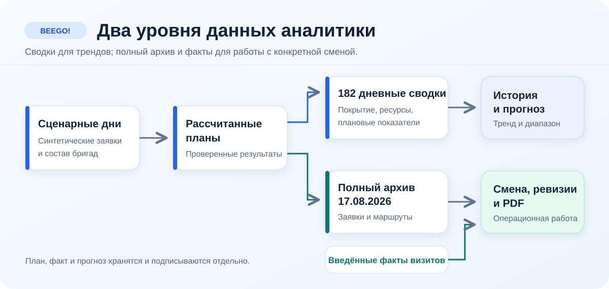

История в `site/public/data/analytics-history.json` содержит сводки рассчитанных синтетических дней. Мы не называем их фактическими выездами. План, факт, прогноз и финансовое допущение имеют разный статус и в тексте, и в интерфейсе. В частности, `actual: null` не превращается в нулевое выполнение; показатель покрытия относится к сохранённому плану, а не к реальному исполнению. Прогноз на такой истории годится для демонстрации метода и проверки интерфейса, но его точность на реальном потоке потребует независимой валидации.

**Почему храним сводки отдельно от полных дней.** На графиках нужны небольшие агрегаты; для открытия карты и событийного пересчёта нужен полный набор заявок, состава и маршрутов. Хранение многогигабайтных операционных архивов в Git только ради графика нецелесообразно; сводка не заменяет полный архив. Форматы и наличие архивов перечислены в [каталоге данных](docs/data.md).

<a id="docker-start"></a>
## 13. Быстрый старт через Docker

Для локального просмотра нужны Docker Engine с Compose и свободный порт `8787`. Из корня репозитория:

```bash
docker compose build app
docker compose up -d app
curl http://127.0.0.1:8787/api/health
```

Откройте **http://127.0.0.1:8787/**. Контейнер запускает собранный React-интерфейс, Node API, SQLite и Python-планировщик. Демонстрационная смена 17.08.2026 загружается в новую базу при первом обращении. База, результаты и кэш живут в отдельных Docker volumes и сохраняются после перезапуска.

Для **новых точных расчётов** нужен локальный маршрутизатор и исходные транспортные данные. Скопируйте [пример настроек](.env.docker.example) в `.env.docker`, укажите пути к каталогу Valhalla с PBF или готовыми tiles, к GTFS и к каталогу метро с `schema.json`, затем запустите:

```bash
docker compose --env-file .env.docker --profile routing up -d --build
docker compose --env-file .env.docker exec app \
  /opt/beego-venv/bin/python /app/algorithm/tools/ensure_local_valhalla.py \
  --endpoint http://valhalla:8002
```

Valhalla работает отдельным контейнером; сайт и Python обращаются к нему по внутреннему имени `valhalla`. Недельные снимки МЦК/МЦД устанавливаются в образ при сборке. Без каталогов GTFS, метро и Valhalla готовый проверенный день доступен для просмотра, но новый точный расчёт не запустится. Ключи Geoapify и AI задаются только через локальный `.env.docker`; значения не входят в образ или Git. Подробная подготовка данных и проверка — в [руководстве Docker](docs/docker.md).

<a id="deployment"></a>
## 14. Развёртывание и проверка стенда

Стенд работает на Yandex Compute Cloud: **4 vCPU, 8 ГБ RAM, SSD 50 ГБ**. Nginx отдаёт сайт и проксирует один Node API; Python-окружение, локальная Valhalla и транспортные данные находятся на той же VM. Это размер под демонстрацию и один одновременно работающий алгоритм, а не обещание пропускной способности при параллельных расчётах.

Код лежит в версиях `/opt/beego/releases/<commit>`, активный релиз выбирается ссылкой `/opt/beego/current`. SQLite и транспортные данные размещены вне сменяемого каталога кода. Это позволяет откатить приложение без подмены плана и не потерять данные при обновлении. Резервная копия SQLite создаётся согласованно; восстановление требует проверки ревизий и фактов. Конкретные команды — в [руководстве стенда](deploy/README_RU.md).

| Проверка | Что подтверждает |
| --- | --- |
| `pnpm run build` в `site/` | Клиент и серверные модули собираются из текущего кода. |
| `pnpm run test:algorithm` | Контракт точного планирования и валидации. |
| `pnpm run test:sites` | Поведение рабочих экранов и связанных модулей. |
| `node --test tests/shift-operations.test.mjs tests/planning-slot.test.mjs` | Ревизии, факты, PDF, один слот и сообщение занятого расчёта. |
| `GET /api/health` | API отвечает на стенде; готовность маршрутизатора проверяется отдельно. |

Перед эксплуатацией с настоящими клиентскими данными потребуются домен и HTTPS, аутентификация с ролями, мониторинг, регулярное обновление карт/расписаний и испытания на реальных днях. Демонстрационный профиль в интерфейсе не заменяет вход пользователя. Эти работы перечислены предметно в [операционной документации](docs/operations.md).

---

**Продолжить:** [форматы и источники данных](docs/data.md) · [модель планирования](docs/planning.md) · [пользовательские сценарии](docs/product.md) · [развёртывание и восстановление](docs/operations.md)
