# BeeGo! — маршрут как проверяемое решение

**От адреса заявки до опубликованного плана смены, который диспетчер может проверить и изменить.**

Мы сделали этот README рассказом о принятых решениях: что видно в продукте, как это обеспечено алгоритмом и почему компоненты устроены именно так. Команды, форматы данных и процедуры развёртывания вынесены в [техническую документацию](docs/README.md).

> [!TIP]
> **Скринкаст: полный рабочий сценарий.** Рекомендуем посмотреть его перед самостоятельным знакомством со стендом: в записи последовательно показаны заявка, план, работа со сменой и отчёт.
>
> <!-- SCREENCAST_LINK: заменить этот комментарий ссылкой [▶ Смотреть скринкаст](URL) -->

**[Открыть стенд](http://84.252.135.110/)** · **[Документация](docs/README.md)** · **[Проверка соответствия требованиям](site/docs/task-requirements.md)**

### Содержание

**Продукт:** [Рабочее пространство](#workspace) · [Данные и адреса](#input) · [Инженеры](#engineers) · [Ход смены](#shift) · [Перепланирование](#replanning) · [Аналитика](#analytics) · [Отчёт и помощник](#report)

**Технология:** [Архитектура](#architecture) · [Алгоритм](#algorithm) · [Дороги и расписания](#routing) · [События и публикация](#events) · [Данные аналитики](#analytics-data) · [Стенд и проверка](#deployment)

---

## 01. Рабочее пространство: один день, одна картина

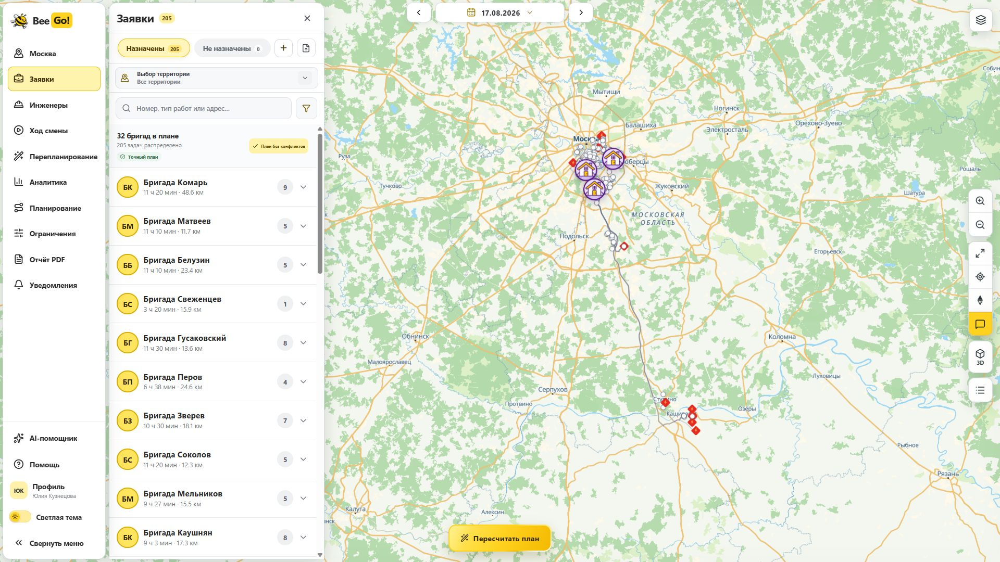

На карте видны точки и маршруты, в левой панели — точные сведения о заявках и бригадах. Нажатие на маршрут связывает геометрию с порядком визитов, временем и составом работ. Мы сохранили карту как рабочий контекст во всех основных разделах: при переходе к смене, аналитике или отчёту диспетчер не теряет день, с которым работает.

**Почему так.** Плотность точек хорошо показывает географию, но по одной карте нельзя проверить окно клиента, навык инженера и последовательность визитов. Поэтому каждое действие имеет текстовое представление, а цвет линии не служит доказательством допустимости маршрута.

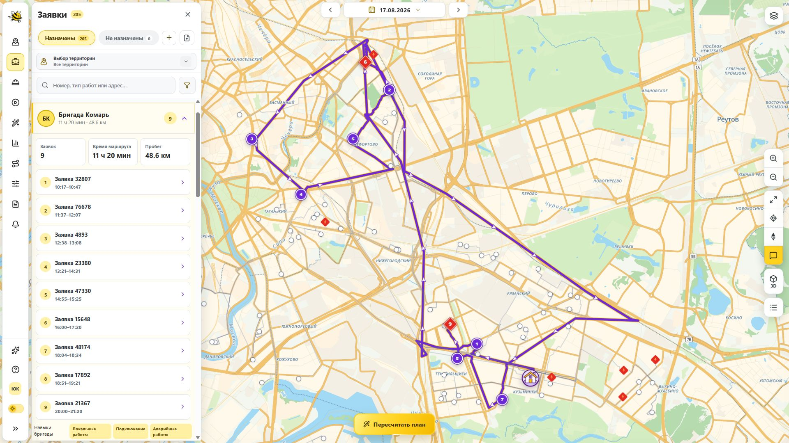

Карта умеет выделять маршрут, показывать стартовые точки, заявки и режим просмотра смены. Для новой точки с сомнительным адресом система не рисует «убедительный» маршрут до случайных координат: сначала требуется подтвердить геокодирование.

## 02. Входные данные и поиск адреса

Заявки и состав инженеров принимаются из CSV/JSON; XLS/XLSX доступны через экран импорта. Сопоставление столбцов, проверка обязательных полей и предпросмотр строк происходят **до** расчёта. Координаты из источника сохраняются; для текстового адреса используется серверный Geoapify. Ответ с недостаточной точностью требует проверки человеком.

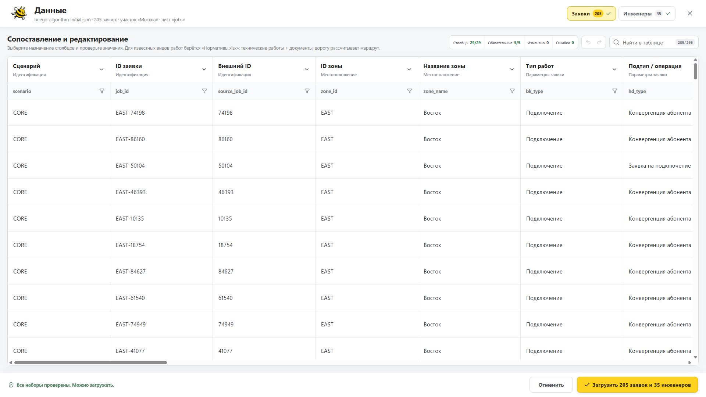

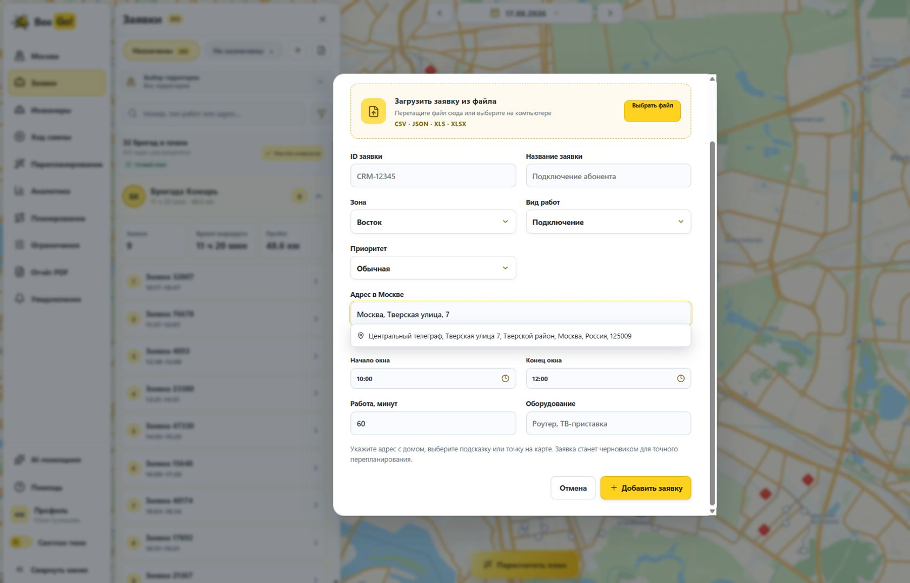

Ручная заявка проходит тот же путь: адрес можно выбрать из подсказки или указать на карте, затем задать работу, приоритет, окно и оборудование. Она становится входом для **черновика** перепланирования, а не незаметным изменением уже опубликованного маршрута. На стенде поиск адреса настроен через серверный ключ; браузер ключ не получает.

**Почему так.** Ошибка в доме или колонке таблицы превращает любой сложный алгоритм в точно рассчитанный неправильный ответ. Предпросмотр импорта и явная неопределённость адреса дешевле такого сбоя. Для поиска по городу мы подключили Geoapify отдельно от дорожного расчёта: геокодер определяет точку, Valhalla и транспортный индекс считают путь.

## 03. Инженеры: возможности до распределения

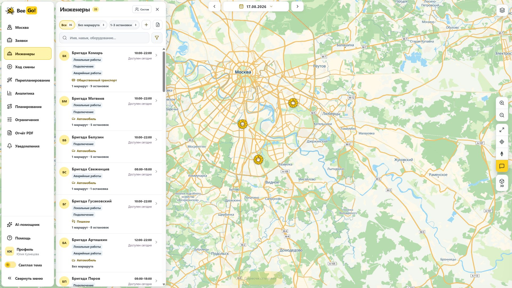

В реестре видны доступность, зона, навыки, транспорт и оборудование. Карточка раскрывает назначенные остановки и загрузку конкретного инженера; отдельный состав смены позволяет добавить резерв или вывести человека из работы через событие.

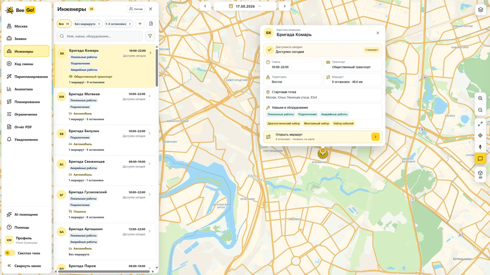

**Почему так.** Бригада — не просто точка старта. От её допуска и оснащения зависит, можно ли вообще рассматривать пару «инженер — заявка». Алгоритм отсекает несовместимые пары до дорогого поиска, а интерфейс показывает причину, чтобы диспетчер не воспринимал отказ как случайность.

## 04. Ход смены: план и факт существуют отдельно

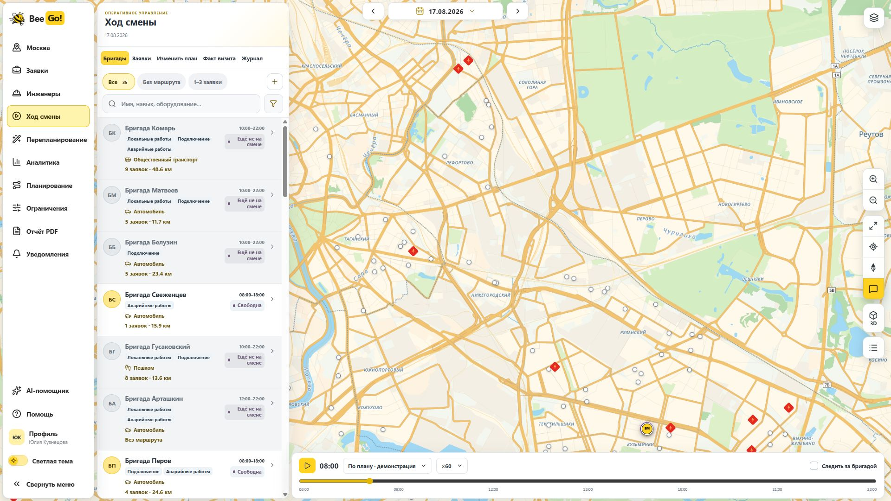

В «Ходе смены» доступны маршрутные бригады и заявки, шкала времени, события и фактические отметки. Проигрывание времени помогает ориентироваться в опубликованном плане; **оно не выдаёт плановую остановку за выполненный визит**. Факт вводит диспетчер. Невыполненная и отменённая работа остаются разными состояниями.

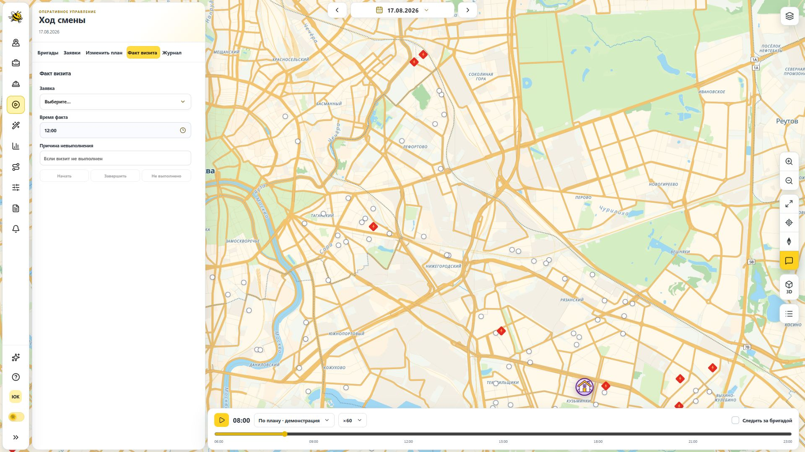

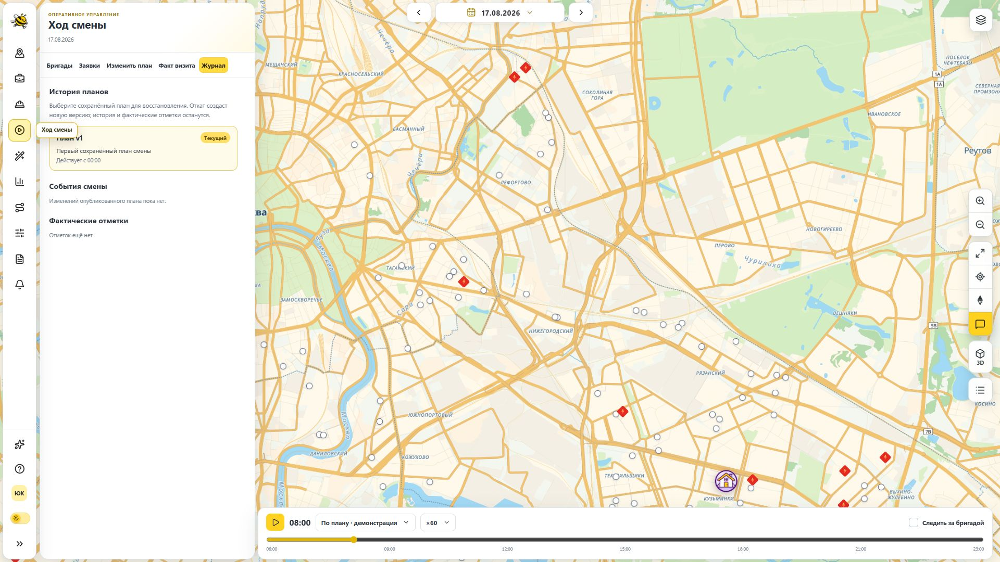

**Почему так.** Приоритет плана не должен стирать операционную историю. Отдельные факты позволяют после смены отличить ошибку маршрута от отмены клиентом и не подменяют реальное исполнение анимацией карты.

## 05. Перепланирование: сначала черновик, потом публикация

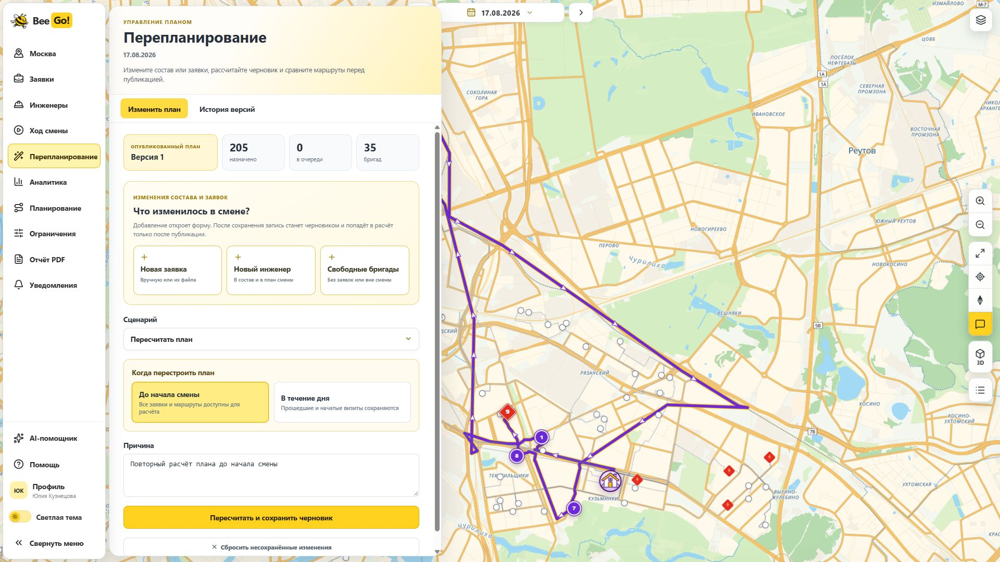

Новая авария, отмена, недоступность инженера, изменение окна или добавление ресурса оформляются как событие. Отмена снимает заявку с будущего маршрута; опубликованный план меняется только после проверки и подтверждения черновика. Для новой заявки планировщик сначала ищет точную вставку в действующие маршруты. Если она не найдена, он заново собирает будущую часть дня, сохраняя уже начатые визиты. Обе попытки ограничены общими 15 минутами; истечение лимита возвращает ошибку, а не выдаёт непроверенное отсутствие назначения. Только после завершённой перестройки без допустимого назначения заявка остаётся в очереди. Клиентское окно не переносится автоматически.

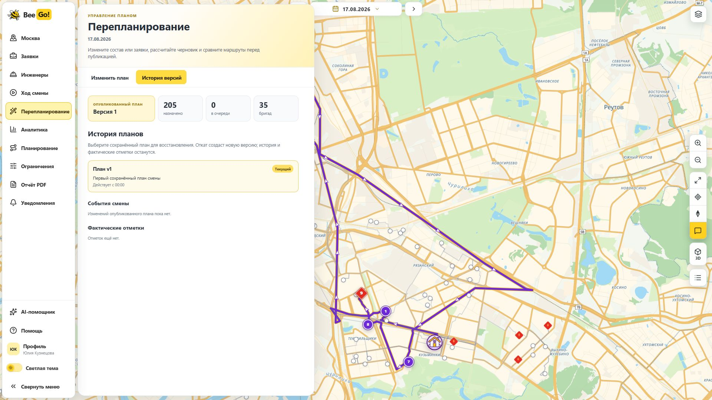

Публикация создаёт новую версию и запись в журнале; прежнюю можно восстановить отдельной новой ревизией. Черновик и опубликованный план хранятся раздельно, поэтому сбой расчёта или закрытие вкладки не переписывает текущую смену.

**Почему так.** Диспетчер должен видеть, какое обещание клиенту меняется. Автоматическая замена активного плана после каждого события лишила бы человека возможности проверить последствия и объяснить решение.

## 06. Аналитика: каждый показатель отвечает на свой вопрос

### Смена

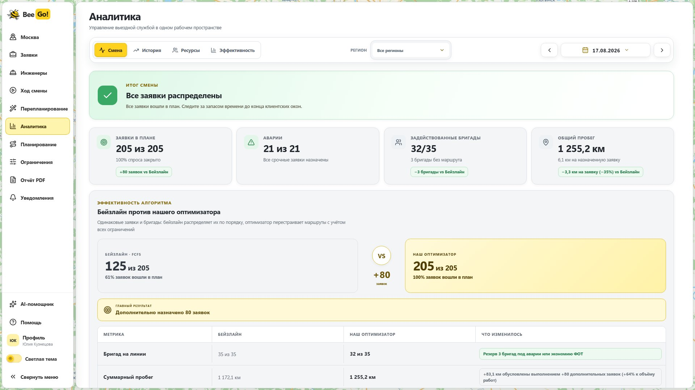

Для контрольного дня **17.08.2026** сохранённый проверенный план назначает **205 из 205** заявок, включая **21 аварийную**, задействует **32 из 35** бригад; суммарный маршрут — **1 255,2 км**. Это результат конкретного набора и принятых расписаний. Число «назначено» всегда показывается вместе с очередью, пробегом и количеством задействованных людей: один показатель не должен маскировать цену решения.

На экране есть ориентир FCFS («в порядке поступления»): **125 из 205**. Он рассчитывается интерфейсной моделью с приближением расстояний по координатам и типовыми скоростями, тогда как основной план использует локальные дороги и расписания. Разницу по километрам нельзя трактовать как строгий выигрыш на одинаковой транспортной модели. Отдельный алгоритмический baseline — другой артефакт; эти два сравнения мы не смешиваем.

### История и прогноз

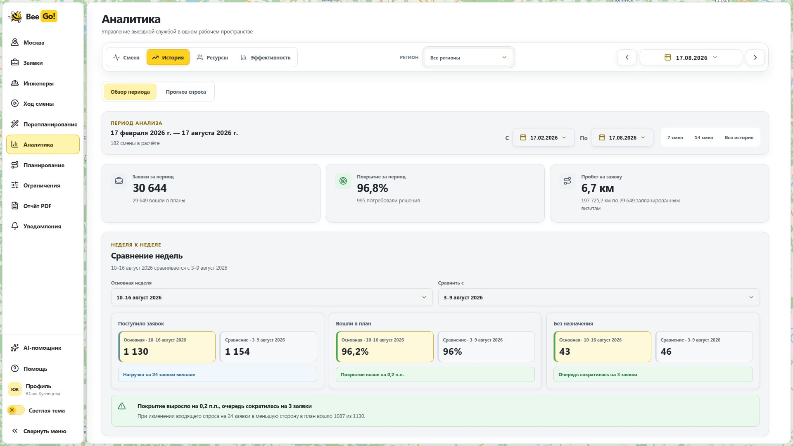

История охватывает **182 дня** с 17.02 по 17.08.2026. Она показывает серию рассчитанных сценариев, а не 182 дня фактической телеметрии. Пустой `actual` означает отсутствие отметки исполнения, не «ноль выполненных». Полный операционный архив, пригодный для повторного открытия и событийного расчёта на стенде, сохранён для 17.08.2026; агрегированная история доступна шире.

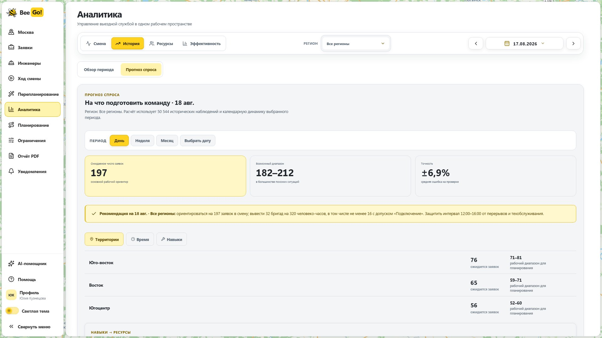

Прогноз показывает число, интервал и ошибку на истории, а также ожидаемый спрос по территориям и навыкам. Для следующего дня на текущем экране — **197 заявок**, диапазон **182–212**, WAPE **±6,9%**. Обучающие наблюдения сформированы из сценарных данных; мы показываем неопределённость, потому что одиночное число без диапазона было бы ложной точностью.

### Ресурсы и эффективность

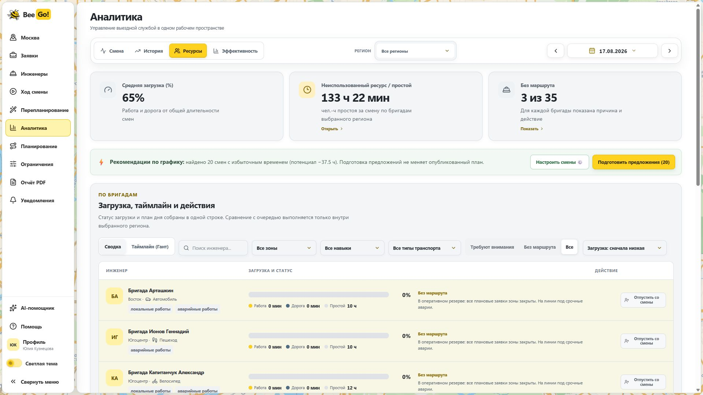

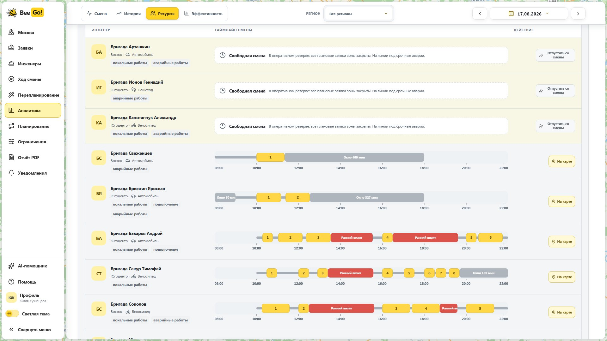

Сводка ресурсов и временная диаграмма отвечают на разные вопросы: у кого нет маршрута, где день перегружен, когда возникает простой и насколько сгущены окна. Их назначение — подсказать действие диспетчеру, а не заменять повторную проверку ограничений.

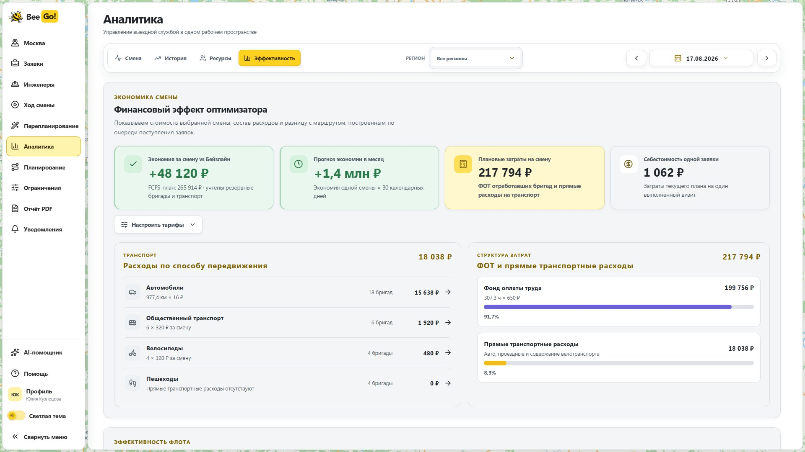

Экономический раздел переводит плановые часы и пробег в оценку по заданным ставкам. Выводы и месячная проекция — **сценарная модель**, не подтверждённая бухгалтерская экономия. На практике её нужно калибровать фактическими затратами и отдельным контрольным периодом.

## 07. Отчёт, AI и вспомогательные разделы

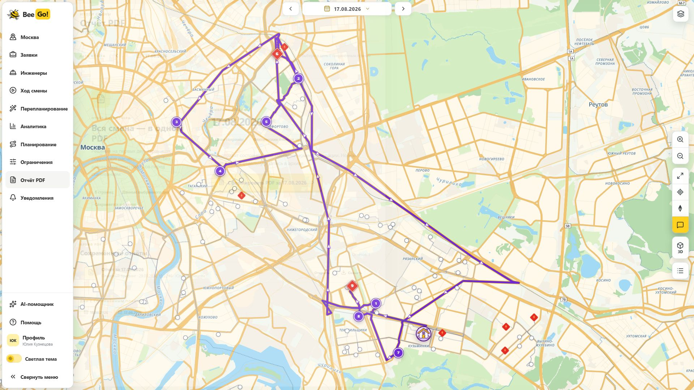

PDF собирается на сервере из сохранённой ревизии смены: итог, маршруты, очередь, ресурсы, события и факты. Новый выпуск попадает в архив отдельной записью; старый не перезаписывается. Мы вынесли итог на первые страницы, а детализацию оставили дальше, чтобы руководитель мог быстро прочесть вывод и затем проверить основание.

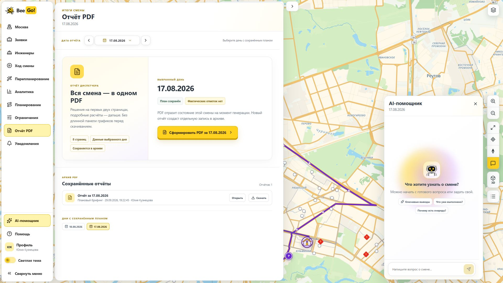

AI-помощник получает ограниченный снимок выбранной смены и отвечает на вопросы о нём. Он **не публикует план, не меняет цифры PDF и не запускает алгоритм**. Ключ Yandex AI Studio остаётся на сервере; лимиты запросов и токенов защищают небольшой стенд от случайного расхода. Если внешняя AI-служба недоступна, планирование и отчёт работают самостоятельно.

Уведомления собирают результаты операций и важные события; справка проводит по интерфейсу. Профиль на стенде отвечает за отображаемые данные и оформление, **не является системой аутентификации**. Эта граница видна и в архитектуре доступа.

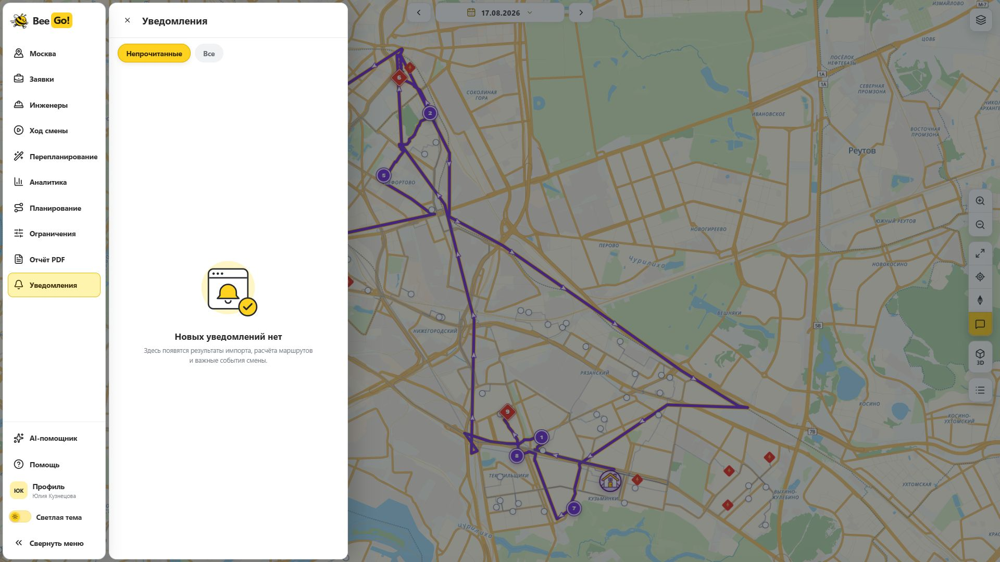

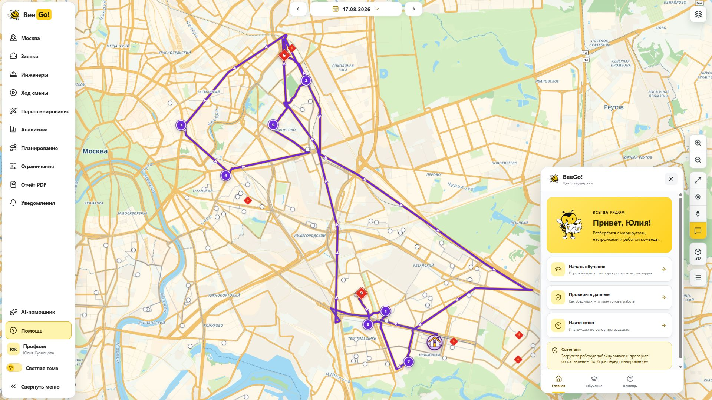

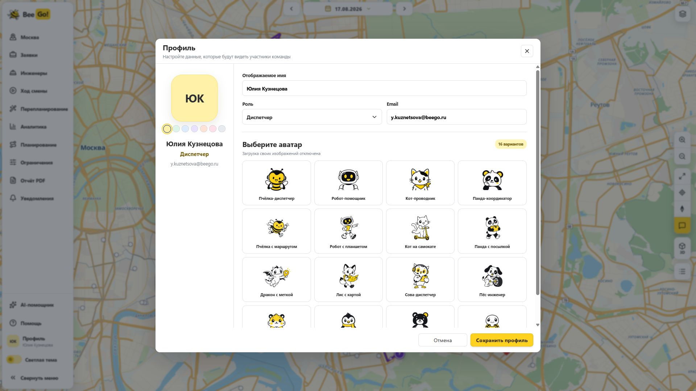

### Что в интерфейсе пока только предпросмотр

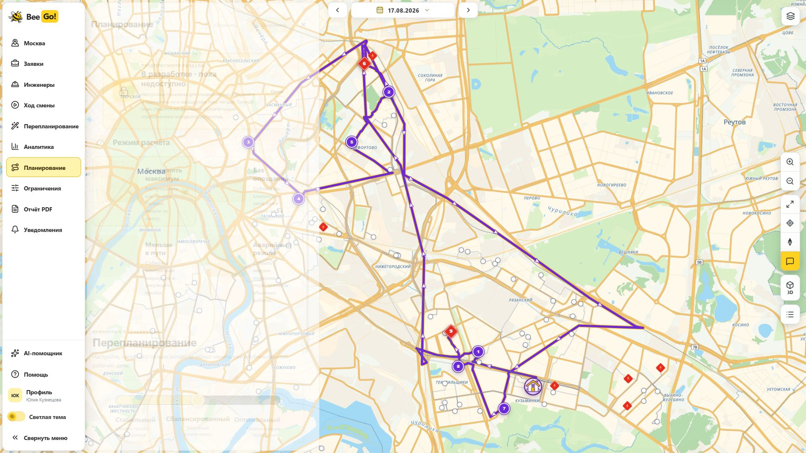

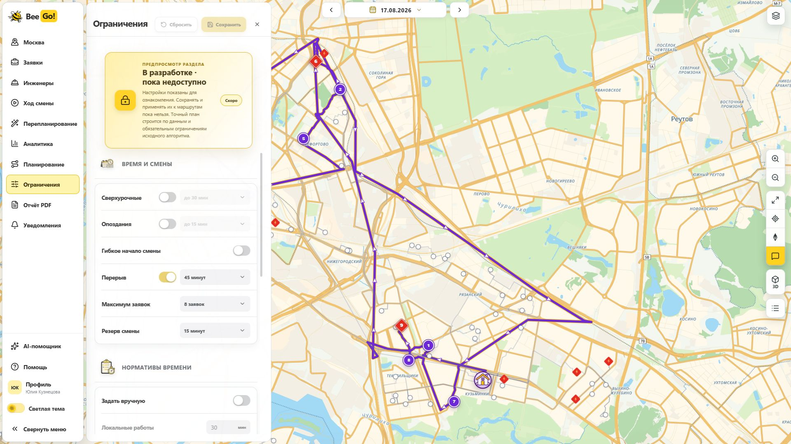

Разделы «Планирование» и «Ограничения» обозначены как **предпросмотр**. Их переключатели не меняют алгоритм и не сохраняют правила. Рабочие ограничения задаются исходными данными и серверным планировщиком. Мы маркируем это прямо в продукте, чтобы пользователь не принял макет настройки за действующий контроль.

---

## 08. Архитектура: граница между интерфейсом и решением

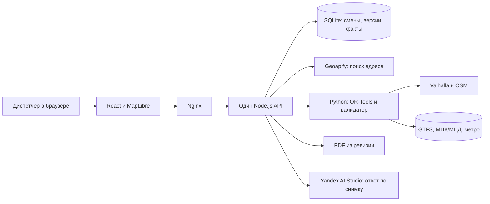
```mermaid
flowchart LR
  D[Диспетчер в браузере] --> UI[React и MapLibre]
  UI --> N[Nginx]
  N --> API[Один Node.js API]
  API --> DB[(SQLite: смены, версии, факты)]
  API --> GEO[Geoapify: поиск адреса]
  API --> PY[Python: OR-Tools и валидатор]
  PY --> ROAD[Valhalla и OSM]
  PY --> TR[(GTFS, МЦК/МЦД, метро)]
  API --> PDF[PDF из ревизии]
  API --> AI[Yandex AI Studio: ответ по снимку]
```

Клиент показывает данные и отправляет намерение пользователя. Node API контролирует запись, версии и доступ к вычислительному слоту. Python-ядро ищет и проверяет план. Такое разделение не даёт интерфейсу объявить кандидат опубликованным только потому, что линия нарисовалась на карте. Все секреты и внешние вызовы находятся на сервере.

| Компонент | Почему именно здесь |
| --- | --- |
| React/Vite + MapLibre | Быстрый интерактивный обзор карты, списков и временной шкалы без переноса правил допустимости в браузер. |
| Node API + SQLite | Транзакционные версии, журнал и факты для **одного** небольшого стенда; простое восстановление из копии. |
| Python + OR-Tools CP-SAT | Модель назначения и порядка визитов с жёсткими ограничениями, отделённая от UI. |
| Valhalla + локальный транспорт | Повторяемые массовые дорожные проверки без тарификации каждого запроса коммерческого API. |
| Отдельные PDF и AI | PDF воспроизводим по ревизии; свободный текст AI не участвует в числах и публикации. |

## 09. Алгоритм: от допустимой пары до проверенного дня

```mermaid
flowchart LR
  A[Импорт и нормализация] --> B[Кандидаты: зона, навык, транспорт, оснащение]
  B --> C[Поисковые матрицы]
  C --> D[CP-SAT: назначение и порядок]
  D --> E[Детальные поездки по времени отправления]
  E --> F[Локальный ремонт и уточнение]
  F --> G[Независимый валидатор]
  G -->|VALID| H[Черновик или версия плана]
  G -->|Ошибка| X[Причина и запрет публикации]
```

### 9.1. Сначала отсекаем невозможное

Для каждой пары «заявка — инженер» проверяются создание заявки к моменту расчёта, доступность человека, территория, навык, допустимый транспорт, личное многоразовое оборудование и жёсткое закрепление. Затем проверяется хотя бы теоретическое пересечение окна начала работы со сменой с учётом норматива. Причины отклонения сохраняются кодами, чтобы необслуженная заявка получала объяснение.

Общее оборудование учитывается как ограниченный ресурс по территории; его нельзя «выдать» двум бригадам сверх доступного количества. Входные нормы работ не включают дорогу: подключение **70 мин**, глобальная проблема **80 мин**, дозаказ **20 мин**, локальная работа **30 мин**. Дорога рассчитывается отдельно.

### 9.2. Как соблюдаются ограничения ТЗ

Мы не ограничились фильтрами интерфейса. Правила включены в модель поиска, а [отдельный валидатор](algorithm/src/beeline_planning/validator.py) повторно проходит **готовый план по исходным данным и доказательствам поездок**. Он не принимает решение «на глаз» по карте и возвращает конкретные коды нарушений.

| Правило | Как не допускаем нарушение при поиске | Что независимо проверяется перед публикацией |
| --- | --- | --- |
| Каждая известная заявка имеет ровно один итог | Для заявки CP-SAT задаёт «один инженер **или** очередь». Заявка, созданная позже момента расчёта, ещё не участвует. | Нет дублирования, одновременного назначения и очереди, пропавших и неизвестных заявок (`DUPLICATE_ASSIGNMENT`, `JOB_RESULT_MISSING` и др.). |
| Квалификация и территория | В граф допускаются только доступные инженеры своей зоны с нужным навыком. | Для каждого визита заново сопоставляются инженер, зона, навык и доступность (`ZONE_MISMATCH`, `SKILL_MISSING`, `ENGINEER_UNAVAILABLE`). |
| Транспорт | Требование заявки сопоставляется с режимом инженера до создания пары. | Совпадение разрешённого транспорта и режима фактического дорожного ответа (`TRANSPORT_MISMATCH`, `ROUTE_MODE_MISMATCH`). |
| Личное и общее оборудование | Личный многоразовый комплект проверяется для пары; общий расходуемый запас ограничен суммой назначений по зоне. | Достаточность у инженера и суммарный лимит склада (`PERSONAL_EQUIPMENT_MISSING`, `SHARED_INVENTORY_EXCEEDED`). |
| Окно клиента и смена | Время старта работы — переменная в закрытом клиентском окне; дорога, ожидание и норматив должны уложиться в смену. | Начало не раньше прибытия и внутри окна; окончание работы до конца смены (`SERVICE_BEFORE_ARRIVAL`, `TIME_WINDOW_VIOLATED`, `SHIFT_VIOLATED`). Ранний приезд с ожиданием допустим. |
| Непрерывность маршрута | Дуги образуют последовательность от стартового офиса; ограничены число заявок и длительность маршрута. Возврат в офис для MVP не обязателен. | Каждый участок начинается там, где закончился предыдущий, рассчитан на нужное время отправления; нет перекрытия работ и превышения лимитов (`ROUTE_CHAIN_BROKEN`, `ROUTE_DEPARTURE_MISMATCH`, `MAX_JOBS_EXCEEDED`, `MAX_ROUTE_MINUTES_EXCEEDED`). |
| Доступность дороги | Поисковая оценка только предлагает дугу; итоговая последовательность пересчитывается детальным провайдером. | Недостижимый или неизвестный путь, несоответствие округления минут и фиктивный «нулевой» переезд блокируют план (`ROUTE_UNREACHABLE`, `ROUTE_UNKNOWN`, `ROUTE_ROUNDING_INVALID`, `IDENTITY_ROUTE_INVALID`). |
| Аварии и закрепления | При частичном покрытии сначала минимизируется число необслуженных аварий; после покрытия улучшается время реакции. Жёсткое назначение фиксируется в модели. | Аварийность пересчитывается в метриках, а обязательный инженер проверяется кодом `HARD_COMMITMENT_VIOLATED`. Приоритет не разрешает нарушать время, навык или транспорт. |
| Событие в середине смены | Пересчёт получает время события и замороженную прошлую часть маршрута. | Не изменены уже начатые, идущие и завершённые участки; недоступный инженер не получает новую работу до возвращения (`FROZEN_ACTIVITY_CHANGED`, `UNAVAILABLE_AFTER_EVENT`). |

Входные отметки времени должны иметь часовой пояс и целые минуты; валидатор проверяет это отдельно. Если дорожный ответ отсутствует, статус становится `ROUTING_INCOMPLETE` или `INVALID`, а не `VALID`. Необслуженная работа остаётся в очереди с причиной. Аналитика может оценить потребность в дополнительной бригаде, но такая оценка сама по себе **не является новым маршрутом**: добавленный ресурс проходит полноценный пересчёт.

### 9.3. Поиск не равен доказательству

CP-SAT выбирает назначение и последовательность по быстрому графу допустимых переходов. Поисковые матрицы позволяют перебрать много комбинаций на одной VM; для общественного транспорта они могут недооценить ожидание в конкретную минуту. На уровне цели сначала ищется полное покрытие допустимого набора. После покрытия сокращается число занятых бригад, затем время реакции на аварии; следующие уровни улучшают дорогу, ожидание и баланс. При исчерпании лимита поиск не выдает неполный кандидат за полный подтверждённый результат.

**Почему такой порядок целей.** Пять сэкономленных километров не компенсируют оставленную без обслуживания заявку. Реакция на аварию важна, но не должна незаметно отнимать исполнителя у другой обязательной работы или требовать лишнюю бригаду, когда задача допускает полное покрытие существующим составом.

### 9.4. Проверяем конкретную последовательность

После поиска маршрут каждой бригады рассчитывается последовательно: время отправления на следующий участок зависит от окончания предыдущей работы. Если инженер приехал раньше окна, он может ждать; **начать работу** нужно внутри клиентского окна, закончить — до конца смены. Далее применяются локальные перестановки, переносы и цепочки вытеснений; принятое улучшение снова проходит детальную проверку **всего** плана.

Барьер есть в двух местах: Python выставляет результат независимой проверки, а [серверное хранилище](site/server/shiftStore.mjs) не принимает план без `EXACT_VALID`, `publicationAllowed=true`, `validation.status=VALID`, `contentSha256` и без признака `approximateTravel`. Тот же барьер действует при начальном расчёте и при публикации событийного черновика. `EXACT_VALID` означает допустимость **в рамках входных данных и транспортной модели**, не доказательство глобального оптимума и не знание будущих пробок.

## 10. Дороги и расписания: где мы экономим, где платим точностью

| Движение | Рабочий источник | Как проверяется время |
| --- | --- | --- |
| Автомобиль, велосипед, пеший путь | Локальная Valhalla на OpenStreetMap | Путь по сети, длительность, расстояние и геометрия. |
| Автобус и трамвай | GTFS | Календарь, остановки и конкретное отправление. |
| МЦК и МЦД | Сохранённые ответы Яндекс Расписаний | Отправления эталонного дня недели. |
| Метро | Схема перегонов, входов и пересадок | Явное ожидание **180 секунд при посадке**; полного расписания поездов нет. |

Пешие подходы к станциям считаются по уличной сети. В общей транспортной сети возможны пересадки между наземными маршрутами, метро, МЦК и МЦД; для короткого плеча сравнивается и прямой пеший путь. Время и геометрия наземных/рельсовых участков имеют разное происхождение: схематичная линия на карте не выдаётся за точную траекторию рельсов.

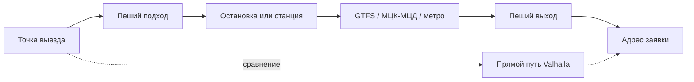
```mermaid
flowchart LR
  O[Точка выезда] --> W1[Пеший подход]
  W1 --> S[Остановка или станция]
  S --> T[GTFS / МЦК-МЦД / метро]
  T --> W2[Пеший выход]
  W2 --> J[Адрес заявки]
  O -. сравнение .-> V[Прямой путь Valhalla]
  V -.-> J
```

**Почему локальная Valhalla.** Для прототипа с многократным перебором матриц и проверкой тысяч участков подписка на коммерческий Routing API 2ГИС была бы существенной и плохо предсказуемой статьёй расходов. Локальный стек даёт воспроизводимость и фиксированную стоимость VM. Мы не заменили дороги прямыми линиями: используем сетевые пути, реальные отправления доступных GTFS/МЦК/МЦД, явные пересадки, время отправления и повторную детальную проверку кандидата.

**Что дало бы подключение 2ГИС в реальном продукте.** [Routing API](https://docs.2gis.com/en/api/navigation/routing/overview) и [Distance Matrix API](https://docs.2gis.com/en/api/navigation/distance-matrix/start) позволили бы получать актуальнее дорожные времена, учитывать пробки и опираться на поддерживаемые провайдером транспортные данные. Это улучшило бы ETA и уменьшило нашу нагрузку по обновлению карт и расписаний. Подписка и лимиты запросов потребовали бы отдельной экономической модели и кэширования. Даже с 2ГИС BeeGo! по-прежнему обязан проверять навыки, оснащение, клиентские окна, общий ресурс и всю смену.

**Недельный эталон МЦК/МЦД.** В [репозитории лежит проверяемый комплект](data/transit/weekly-rail-snapshots-2026-09-29.zip); установщик сверяет размер и SHA-256. Для сценарного дня используется снимок **того же дня недели**. Это пригодно для демонстрации типового графика, но не является историческим расписанием конкретной даты: отмены, ремонт и сезонные изменения требуют обновления данных. При отсутствии нужного снимка расчёт останавливается с причиной вместо выдуманного отправления. Подробности и установка — в [документации данных](docs/data.md).

Geoapify решает **другую** задачу: предлагает адреса и координаты при импорте и ручном вводе. Ключ поиска хранится на сервере; он не меняет провайдера детального дорожного расчёта. Для явного выбора Geoapify как отдельного дорожного провайдера предусмотрен отдельный `GEOAPIFY_ROUTING_API_KEY`.

## 11. Операционная смена: события, ревизии и один расчёт

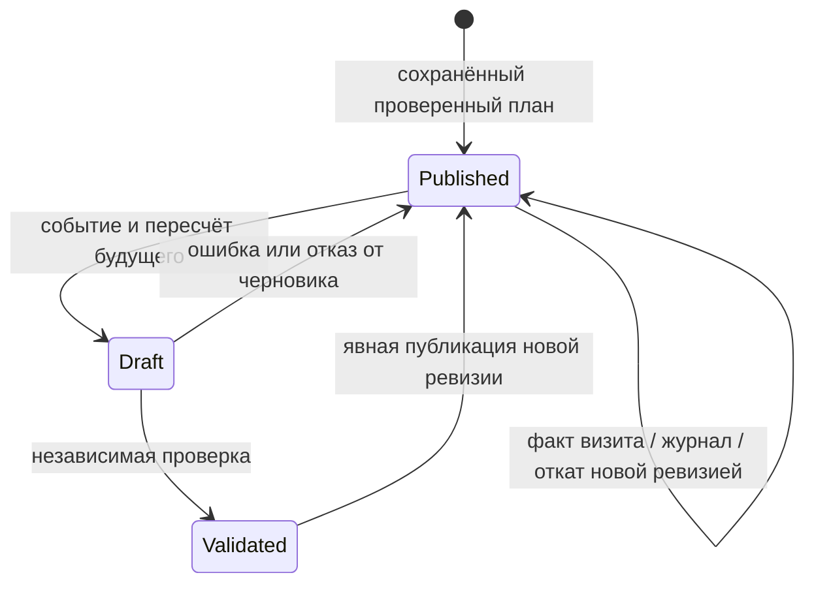
```mermaid
stateDiagram-v2
  [*] --> Published: сохранённый проверенный план
  Published --> Draft: событие и пересчёт будущего
  Draft --> Published: ошибка или отказ от черновика
  Draft --> Validated: независимая проверка
  Validated --> Published: явная публикация новой ревизии
  Published --> Published: факт визита / журнал / откат новой ревизией
```

Событие задаёт время, тип, причину и затронутые сущности. Перепланировщик сохраняет завершённые и начатые визиты, работает с будущей частью маршрута и возвращает проверенный черновик. При публикации в SQLite транзакционно появляются новая ревизия и запись журнала. Факты не выводятся из планового проигрывания. Откат не стирает историю: он создаёт следующую ревизию на основании выбранной старой.

Для новой заявки оперативный поиск отличается от начального CP-SAT: он начинает с **опубликованного точного плана** и проверяет вставку в будущие маршруты с реальной дорогой. Если допустимого слота нет, он освобождает все будущие визиты и собирает остаток дня заново, начиная с новой заявки. Замороженные поездки и работы остаются как были. После обеих попыток результат проходит тот же независимый валидатор; одна общая граница в 15 минут не позволяет зависнуть на переборе. Исчерпанный поиск не превращается в вывод «назначить невозможно».

```mermaid
flowchart LR
  E[Событие и текущая ревизия] --> I[Точная вставка в будущие маршруты]
  I -->|заявка назначена| V[Независимый валидатор]
  I -->|слот не найден| R[Перестройка всего будущего дня]
  R --> V
  V -->|VALID| D[Черновик: назначение или очередь с причиной]
  V -->|ошибка или лимит| B[Отказ от публикации]
  D --> P[Явная публикация новой ревизии]
```

Для повторного запуска на небольшом сервере мы держим **один слот тяжёлого расчёта в одном процессе API**. Второй пользователь может смотреть сайт, но попытка одновременно запустить расчёт получает HTTP `429`, код `PLANNING_BUSY` и сообщение «Подождите: другой пользователь уже запустил расчёт». Слот освобождается и при ошибке. Если позднее появятся несколько API-процессов, понадобится общая очередь или распределённая блокировка: нынешний механизм межпроцессную синхронизацию не обещает.

## 12. Происхождение аналитики и доверие к цифрам

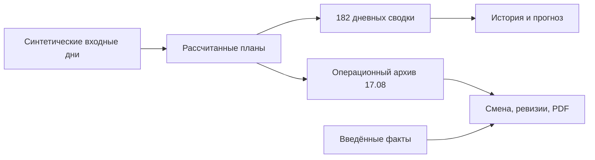
```mermaid
flowchart LR
  I[Синтетические входные дни] --> P[Рассчитанные планы]
  P --> H[182 дневных сводки]
  H --> A[История и прогноз]
  P --> O[Операционный архив 17.08]
  O --> S[Смена, ревизии, PDF]
  F[Введённые факты] --> S
```

История в `site/public/data/analytics-history.json` содержит сводки рассчитанных синтетических дней. Мы не называем их фактическими выездами. План, факт, прогноз и финансовое допущение имеют разный статус и в тексте, и в интерфейсе. В частности, `actual: null` не превращается в нулевое выполнение; показатель покрытия относится к сохранённому плану, а не к реальному исполнению. Прогноз на такой истории годится для демонстрации метода и проверки интерфейса, но его точность на реальном потоке потребует независимой валидации.

**Почему храним сводки отдельно от полных дней.** На графиках нужны небольшие агрегаты; для открытия карты и событийного пересчёта нужен полный набор заявок, состава и маршрутов. Публиковать многогигабайтные операционные архивы в Git ради графика было бы неудобно, а выдавать сводку за полный архив — неверно. Форматы и наличие архивов перечислены в [каталоге данных](docs/data.md).

## 13. Стенд, воспроизводимость и проверка

Стенд работает на Yandex Compute Cloud: **4 vCPU, 8 ГБ RAM, SSD 50 ГБ**. Nginx отдаёт сайт и проксирует один Node API; Python-окружение, локальная Valhalla и транспортные данные находятся на той же VM. Это размер под демонстрацию и один одновременно работающий алгоритм, а не обещание пропускной способности при параллельных расчётах.

Код лежит в версиях `/opt/beego/releases/<commit>`, активный релиз выбирается ссылкой `/opt/beego/current`. SQLite и транспортные данные размещены вне сменяемого каталога кода. Это позволяет откатить приложение без подмены плана и не потерять данные при обновлении. Резервная копия SQLite создаётся согласованно; восстановление требует проверки ревизий и фактов. Конкретные команды — в [руководстве стенда](deploy/README_RU.md).

| Проверка | Что подтверждает |
| --- | --- |
| `pnpm run build` в `site/` | Клиент и серверные модули собираются из текущего кода. |
| `pnpm run test:algorithm` | Контракт точного планирования и валидации. |
| `pnpm run test:sites` | Поведение рабочих экранов и связанных модулей. |
| `node --test tests/shift-operations.test.mjs tests/planning-slot.test.mjs` | Ревизии, факты, PDF, один слот и сообщение занятого расчёта. |
| `GET /api/health` | API отвечает на стенде; готовность маршрутизатора проверяется отдельно. |

Перед эксплуатацией с настоящими клиентскими данными потребуются домен и HTTPS, аутентификация с ролями, мониторинг, регулярное обновление карт/расписаний и испытания на реальных днях. Демонстрационный профиль в интерфейсе не заменяет вход пользователя. Эти работы перечислены предметно в [операционной документации](docs/operations.md).

---

**Продолжить:** [форматы и источники данных](docs/data.md) · [модель планирования](docs/planning.md) · [пользовательские сценарии](docs/product.md) · [развёртывание и восстановление](docs/operations.md)
