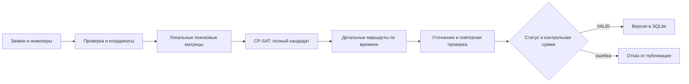

# Планирование и публикация

[Документация](README.md) · [Главный README](../README.md)

## Ограничения

- Навык инженера должен покрывать работу; транспорт и оборудование проверяются отдельно.
- Время движения учитывается по сети дорог/транспорта. Прибытие и начало работы должны попасть в клиентское окно. Раннее прибытие допускает ожидание; полная длительность работы и дорога должны поместиться в смену.
- Уже начатые и прошедшие визиты нельзя переносить событийным расчётом.
- Клиентское окно не изменяется автоматически. Необслуженная заявка сохраняется в очереди с причиной, вместо фиктивного назначения.

## Конвейер

Python-ядро использует OR-Tools CP-SAT. Поиск стремится сначала покрыть максимум допустимых заявок; после полного покрытия сокращает число бригад, затем время реакции на аварии и транспортные затраты. Поисковая матрица служит для отбора кандидатов и может недооценить ожидание транспорта. Итоговый маршрут пересчитывается **последовательно с фактическим временем отправления** для каждого следующего визита. После уточнения результат проверяется отдельно от поиска.

## Барьер публикации

Операционное хранилище принимает только план, у которого `status=EXACT_VALID`, `publicationAllowed=true`, `validation.status=VALID`, есть `contentSha256`, массивы маршрутов и неназначенных заявок, а `approximateTravel` не равен `true`. Если проверка не прошла, прежний опубликованный план остаётся доступным. «Точный» здесь значит допустимый **в рамках заданных входных данных и модели дорожного времени**; глобальный оптимум и точность будущих пробок этим статусом не доказываются.

Перепланирование хранит черновик отдельно от текущей версии. Диспетчер видит различия и публикует после проверки. События, версии и введённые факты сохраняются в SQLite; после перезапуска незаконченный расчёт можно запустить вновь, опубликованный план не подменяется. Подробнее о модели смены — в [операционном описании сайта](../site/docs/shift-operations.md).

## Одновременные запросы

Один серверный слот защищает тяжёлый точный расчёт и предпросмотр перепланирования. Пока он занят, новый запуск получает HTTP `429` с кодом `PLANNING_BUSY` и понятным сообщением. Чтение страниц и данных не требует этого слота. Механизм живёт в памяти **одного процесса API**; при горизонтальном масштабировании нужен распределённый замок или очередь.

## Проверка

Код планировщика находится в `algorithm/src/`, серверное подключение — в `site/server/` и `site/scripts/`. Набор проверок и команды: [стенд](operations.md#проверки) и [детали маршрутизатора](../algorithm/routing_README.md).
